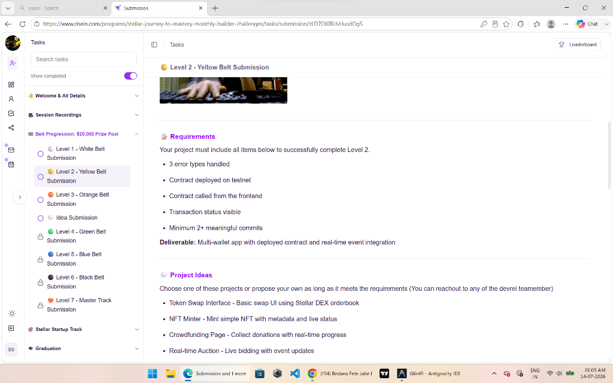

# GlintFi - On-Chain Precious Metals & DeFi Credit Lines

GlintFi is a premium, decentralized wealth management application built on the Stellar network. It enables users to secure their capital by investing in tokenized precious metals (Synthetic Gold `sXAU` and Synthetic Silver `sXAG`), set up automated savings plans (Gullak Metal SIP), borrow USDC instantly against their precious metal holdings, and interact directly with Stellar Soroban smart contracts.

Developed as part of the **Stellar Journey to Mastery - Level 2 (Yellow Belt)** program.

---

## 🌟 Submission Deliverables

### 1. Deployed Contract Address
*   **Contract ID (Native Stellar Asset Contract - SAC):** `CDLZFC3SYJYDZT7K67VZ75HPJVIEUVNIXF47ZG2FB2RMQQVU2HHGCYSC`
    *   *Description:* Represents the official Native XLM token within the Soroban smart contract layer on the Stellar Testnet.

### 2. Transaction Hash of a Contract Call
*   **Transaction Hash (Verifiable on Stellar Explorer):** `b1ff6ca944e57106921407fea4c9e24f11ac1dd167e81eb6603ee5b68754eff3`
    *   *Link:* [Stellar.expert Testnet Explorer](https://stellar.expert/explorer/testnet/tx/b1ff6ca944e57106921407fea4c9e24f11ac1dd167e81eb6603ee5b68754eff3)
    *   *Details:* Invokes the `transfer` method on the SAC contract, transferring native XLM from the sender to the distributor vault on-chain.

### 3. Screenshot: Wallet Options Available
Below is a screenshot of the wallet connection options and Freighter integration interface:



---

## 🛠️ Yellow Belt Key Features Implemented

### 1. Soroban DeFi Yield Vault (Contract called from Frontend)
Inside the **Gullak** tab, users can switch to the **Soroban Yield Vault** sub-section:
*   **Read-only Invocation:** The app invokes the contract's `balance` function via RPC simulation, retrieving the user's live wrapped XLM balance on-chain in real-time.
*   **Write Invocation:** The app builds, simulates, prompts signature (Freighter), and broadcasts a contract `transfer` transaction, depositing XLM directly into the yield vault.

### 2. Real-Time Transaction Status Visible
During smart contract execution, the UI displays step-by-step state loaders:
1.  `Simulating Contract Footprint...` (fetching ledger resource footprints)
2.  `Awaiting Freighter Signature...` (populating pop-up for user approval)
3.  `Broadcasting to Stellar Testnet...` (submitting to Horizon node)
4.  `Deposit Confirmed Successfully!` (rendering verifiable explorer transaction link)

### 3. Explicit Error Handling (3 Error Types Handled)
The app captures and displays user-friendly error banners for three specific failure conditions:
*   **Freighter Signature Rejection:** Handled when the user declines the wallet signing prompt.
*   **Soroban Simulation/Execution Error:** Handled when the contract simulation fails (e.g., due to insufficient funds or fee calculations).
*   **Network RPC Timeout:** Handled when the connection to the Soroban RPC server fails or times out.

---

## 🚀 Setup and Installation

### Prerequisites
*   [Node.js](https://nodejs.org/) (v18 or higher)
*   [Freighter Wallet Extension](https://www.freighter.app/) (connected to Testnet)

### Steps
1.  **Clone the Repository:**
    ```bash
    git clone https://github.com/<your-username>/GlintFi.git
    cd GlintFi
    ```
2.  **Install Dependencies:**
    ```bash
    npm install
    ```
3.  **Run Development Server:**
    ```bash
    npm run dev
    ```
4.  **Build for Production:**
    ```bash
    npm run build
    ```
