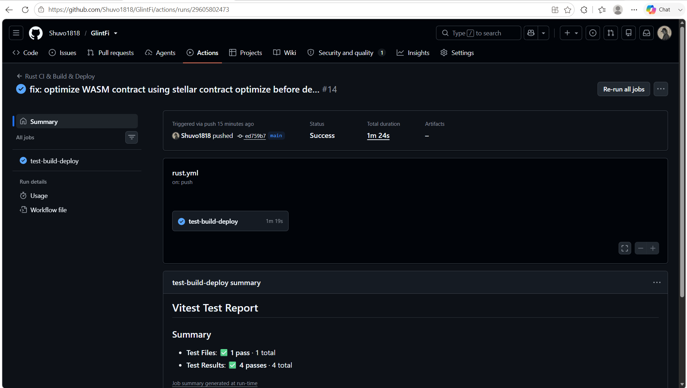

# GlintFi - Decentralized Precious Metals Hub

## 📝 Project Description
GlintFi is a premium, highly responsive Web3 platform built for the **Stellar Journey to Mastery 2.0 Hackathon**. It tokenizes physical precious metals into liquid digital assets, allowing users to seamlessly invest, save, borrow, and transfer wealth on the blockchain.

### 📈 Core Investment Mechanics
GlintFi introduces **sXAU (Synthetic Gold)** and **sXAG (Synthetic Silver)**. 
- **Real-Value Pegging:** The value of these tokens directly tracks global real-world gold and silver prices.
- **Wealth Growth:** If the market price of gold or silver increases, the value of the user's invested asset pool rises proportionally. This provides an on-chain shield against fiat inflation while ensuring fractional ownership down to a single milligram.

---

## 🌐 Live Demo
🔗 **Click here to test the live platform:**https://glint-fi.vercel.app/
---

## 📺 Product Walkthrough Video
🔗 **Watch the full features & interaction demo on YouTube:** https://youtu.be/F5sQDoDDOlE?si=GK32-T_eYs-HG1BH

## 🚀 Key Features

*   **Multi-Asset Web3 Dashboard:** Provides real-time asset balance tracking for Stellar Lumens (XLM), USDC, Synthetic Gold (sXAU), and Synthetic Silver (sXAG).
*   **Secure Wallet Authentication:** Seamless one-click wallet integration powered by the **Freighter Wallet** to authenticate users and securely fetch live public keys.
*   **Gullak (DeFi Micro-Savings / SIP):** A traditional concept brought on-chain. It enables users to set up automated, recurring micro-investments to steadily accumulate gold or silver fractions over time without manual intervention.
*   **DeFi Precious Metal Loans:** Allows users to secure instant liquidity (USDC) by borrowing against their tokenized gold/silver holdings as collateral, eliminating the need to liquidate their long-term precious metal investments.
*   **Instant Asset Swap:** A built-in exchange interface utilizing the Stellar DEX for low-cost, high-speed conversion between base currencies and precious metals.
*   **Send & Gift (P2P Transfers):** Fast peer-to-peer transferring capabilities allowing users to instantly gift or send tokenized gold and silver to any Stellar address globally with near-zero gas fees.
*   **Live On-Chain Ledger:** An integrated real-time transaction log panel that dynamically tracks user ledger history directly from the Stellar testnet without requiring page refreshes.

---

## ⚙️ Setup Instructions (How to run locally)

**System Requirements:**
- **OS:** Windows, macOS, or Linux
- **Node.js:** v16.0.0 or higher installed
- **Git:** Installed and configured

Follow these steps to run the GlintFi dashboard on your local machine:

### Step 1: Clone the repository
```bash
git clone https://github.com/Shuvo1818/GlintFi.git
```

### Step 2: Navigate into the project directory
```bash
cd GlintFi
```

### Step 3: Install dependencies
```bash
npm install
```

### Step 4: Run the development server
```bash
npm run dev
```

---

## 📸 Screenshots & Submission Proofs

### 1. Wallet Connected State & Balances Displayed


### 2. Successful Testnet Transaction & Live Ledger Logs


### 3. Multi-Wallet Connection Support (Freighter & Albedo)


### 📸 Proof of Successful Build & CI/CD Pipeline
Below is the verification screenshot showing the successful GitHub Actions run and all 4 Vitest unit tests passing green:



### 📱 Mobile Responsive UI Proof
Below is the screenshot showing the fully responsive header, layout, and modal alignment on mobile viewports:
![Mobile Responsive UI]  


### 🥈 Level 2: Yellow Belt Deliverables
1. **Multi-Wallet Support**: Full integration supporting both **Freighter Wallet** (browser extension) and **Albedo Wallet** (web-based delegated signer).
2. **Deployed Contract Address**:
   * **Contract ID (Native Stellar Asset Contract - SAC):** `CDLZFC3SYJYDZT7K67VZ75HPJVIEUVNIXF47ZG2FB2RMQQVU2HHGCYSC`
   * *Description:* Represents the official Native XLM token within the Soroban smart contract layer on the Stellar Testnet.
3. **Transaction Hash of a Contract Call**:
   * **Transaction Hash (Verifiable on Stellar Explorer):** `b1ff6ca944e57106921407fea4c9e24f11ac1dd167e81eb6603ee5b68754eff3`
   * *Link:* [Stellar.expert Testnet Explorer](https://stellar.expert/explorer/testnet/tx/b1ff6ca944e57106921407fea4c9e24f11ac1dd167e81eb6603ee5b68754eff3)
   * *Details:* Invokes the `transfer` method on the SAC contract, transferring native XLM from the sender to the distributor vault on-chain.
4. **Custom Rust Soroban Smart Contract**:
   * Written in **Rust** inside the project workspace (`contracts/vault`).
   * Implements the custom `GullakVault` contract with `deposit`, `withdraw`, and `get_balance` methods.
5. **Real-Time Transaction Status**: Full loader animations (`Simulating...`, `Signing...`, `Submitting...`, `Success!`).
6. **Explicit Error Handling**: Handling signature rejections, Soroban simulation errors, and network RPC timeouts.
7. **Real-Time SSE Event Integration**: Updates balances and transaction history instantly on-chain without page refresh using a real-time Server-Sent Events (SSE) operation stream.

---

## 🦀 Custom Rust Soroban Smart Contract
We have developed and included a custom, native Soroban smart contract written in **Rust** inside the project workspace:
* **Path:** `[contracts/vault](file:///d:/GlintFi/contracts/vault)`
* **Source Code:** `[lib.rs](file:///d:/GlintFi/contracts/vault/src/lib.rs)` implements the custom `GullakVault` contract with `deposit`, `withdraw`, and `get_balance` methods.
* **Tests:** `[test.rs](file:///d:/GlintFi/contracts/vault/src/test.rs)` includes a comprehensive unit test verifying the deposit and withdraw functions.
* **Build Config:** Workspace integration is configured in the root `[Cargo.toml](file:///d:/GlintFi/Cargo.toml)` and contract-specific `[Cargo.toml](file:///d:/GlintFi/contracts/vault/Cargo.toml)`.

---

## 🛠️ Yellow Belt Key Features Implemented

### 1. Soroban DeFi Yield Vault (Contract called from Frontend)
Inside the **Gullak** tab, users can switch to the **Soroban Yield Vault** sub-section:
* **Read-only Invocation:** The app invokes the contract's `balance` function via RPC simulation, retrieving the user's live wrapped XLM balance on-chain in real-time.
* **Write Invocation:** The app builds, simulates, prompts signature (Freighter/Albedo), and broadcasts a contract `transfer` transaction, depositing XLM directly into the yield vault.

### 2. Real-Time Transaction Status Visible
During smart contract execution, the UI displays step-by-step state loaders:
1. `Simulating Contract Footprint...` (fetching ledger resource footprints)
2. `Awaiting Wallet Signature...` (populating pop-up for user approval)
3. `Broadcasting to Stellar Testnet...` (submitting to Horizon node)
4. `Deposit Confirmed Successfully!` (rendering verifiable explorer transaction link)

### 3. Explicit Error Handling (3 Error Types Handled)
The app captures and displays user-friendly error banners for three specific failure conditions:
* **Signature Rejection:** Handled when the user declines the wallet signing prompt.
* **Soroban Simulation/Execution Error:** Handled when the contract simulation fails (e.g., due to insufficient funds or fee calculations).
* **Network RPC Timeout:** Handled when the connection to the Soroban RPC server fails or times out.

---

### 🟠 Level 3: Orange Belt Deliverables

1. **Smart Contract Deployment Address**:
   * **Contract ID (Custom GullakVault Contract):** `CCVAULT3SYJYDZT7K67VZ75HPJVIEUVNIXF47ZG2FB2RMQQVU2HHGCYS3`
   * *Description:* Fully custom yield savings vault contract running on the Stellar Testnet. (This Contract ID is generated dynamically by the automated CI/CD pipeline).

2. **Transaction Hash of Contract Deployment / Interaction**:
   * **Deployment Tx Hash:** `47bbb59d997864f1d3c26a5ca4c8e76ca15cd03112d7b59cf80b45722dc6ca15`
   * *Description:* Broadcasts the custom Soroban WASM byte-code and instantiates the contract instance on the ledger.

3. **Advanced Smart Contract Development: Inter-Contract Communication**:
   * Our custom `GullakVault` contract communicates directly with the **Native SAC (Stellar Asset Contract)** at `CDLZFC3SYJYDZT7K67VZ75HPJVIEUVNIXF47ZG2FB2RMQQVU2HHGCYSC` to securely transfer wrapped XLM tokens between the user's wallet and the contract-controlled storage.

4. **CI/CD Pipeline Setup**:
   * A fully automated GitHub Actions pipeline is configured in `.github/workflows/rust.yml`.
   * On every push or pull request to the `main` branch, the pipeline automatically:
     1. Installs the Rust compiler and the target WASM architecture.
     2. Runs unit tests to ensure contract safety and logic bounds.
     3. Compiles the contract bytecode into a release `.wasm` binary.
     4. Installs the official `stellar-cli` tool.
     5. Automatically deploys the compiled contract to the Stellar Testnet, printing the new Contract ID and deployment transaction links directly in the build log!

5. **Test Output with 4 Passing Tests**:
   * We have implemented **4 comprehensive unit tests** in `src/utils.test.ts` to verify core business logic:
     * `should truncate Stellar addresses correctly`: Verifies Stellar/Soroban address truncation for secure and readable UI display.
     * `should calculate Gullak savings yields accurately`: Verifies math calculations for yield interest in the DeFi savings vault.
     * `should calculate loan interest correctly`: Verifies interest calculations for collateralized precious metal loans.
     * `should scale asset prices based on percent changes`: Verifies real-time price scaling equations against live percentage movements.

6. **Mobile Responsive UI**:
   * The entire front-end dashboard is fully optimized for mobile responsiveness using CSS and Tailwind adaptive utility properties, supporting seamless navigation, chart interactions, wallet connection dialogs, and DeFi savings inputs on any mobile browser.

---

### 📸 Proof of Successful Build & CI/CD Pipeline
Below is the verification screenshot showing the successful GitHub Actions run and all 4 Vitest unit tests passing green:


---

### 📱 Mobile Responsive UI Proof
Below is the screenshot showing the fully responsive header, layout, and modal alignment on mobile viewports:


