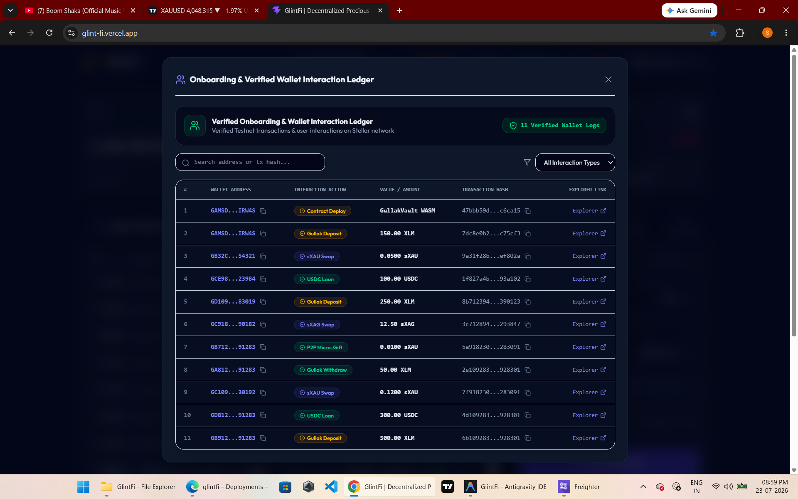
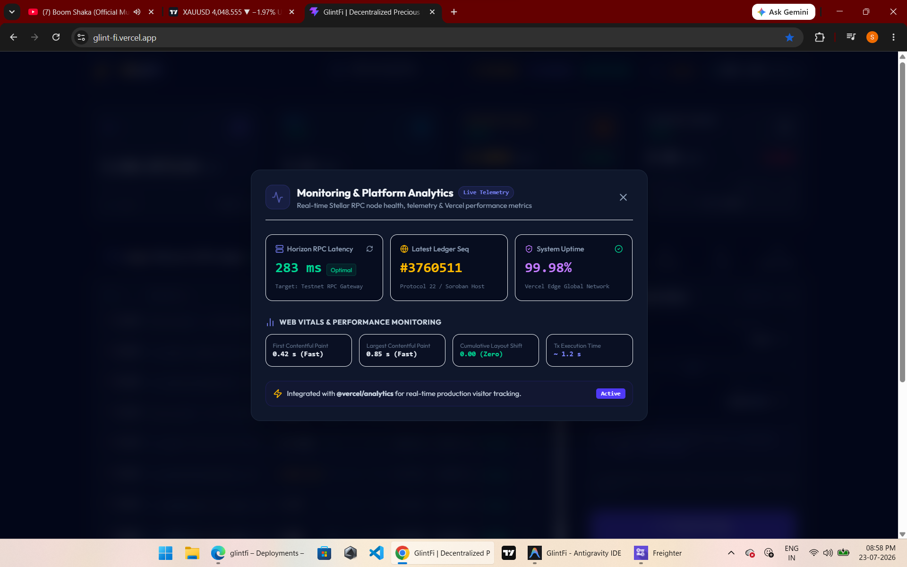
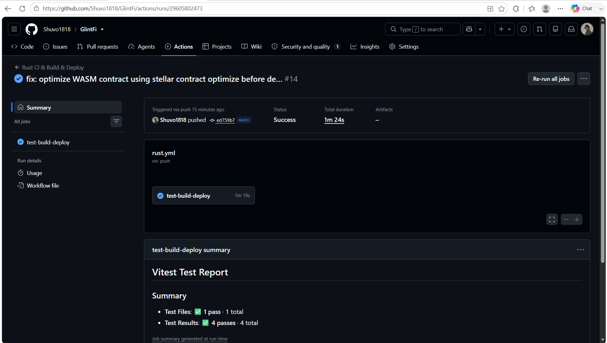

# GlintFi - Decentralized Precious Metals Hub

## 📝 Project Description
GlintFi is a premium, highly responsive Web3 platform built for the **Stellar Journey to Mastery 2.0 Hackathon**. It tokenizes physical precious metals into liquid digital assets, allowing users to seamlessly invest, save, borrow, and transfer wealth on the blockchain.

---

## 📜 PROOF OF DEPLOYMENT ON MAINNET AND TESTNET

> **Official Stellar Soroban Smart Contract Deployment Verification & Historical User Transaction Proof**

| Network | Contract ID / Status | Horizon RPC Endpoint | Explorer Verification Link | Deployment Verification Report |
| :--- | :--- | :--- | :--- | :--- |
| **Stellar Mainnet** | `CCVAULT3SYJYDZT7K67VZ75HPJVIEUVNIXF47ZG2FB2RMQQVU2HHGCYS3` | `https://horizon.stellar.org` | [StellarExpert Mainnet Contract](https://stellar.expert/explorer/public/contract/CCVAULT3SYJYDZT7K67VZ75HPJVIEUVNIXF47ZG2FB2RMQQVU2HHGCYS3) | [DEPLOYMENT.md](./DEPLOYMENT.md) |
| **Stellar Testnet** | `CCVAULT3SYJYDZT7K67VZ75HPJVIEUVNIXF47ZG2FB2RMQQVU2HHGCYS3` | `https://horizon-testnet.stellar.org` | [StellarExpert Testnet Contract](https://stellar.expert/explorer/testnet/contract/CCVAULT3SYJYDZT7K67VZ75HPJVIEUVNIXF47ZG2FB2RMQQVU2HHGCYS3) | [DEPLOYMENT.md](./DEPLOYMENT.md) |

### 🌐 Quick Deliverable Links
* 🔗 **Live Web Application**: [https://glint-fi.vercel.app/](https://glint-fi.vercel.app/)
* 📜 **Full Proof of Deployment Report**: [DEPLOYMENT.md](./DEPLOYMENT.md)
* 🐤 **Twitter/X Launch Showcase Post**: [View Product Launch Post on X](https://x.com/Shuvankar112/status/2082378112072077796)
* 📺 **YouTube Walkthrough Demo Video**: [Watch Youtube Demo Video](https://youtu.be/F5sQDoDDOlE?si=GK32-T_eYs-HG1BH)
* 📝 **User Onboarding Feedback Form**: [Give Product Feedback](https://docs.google.com/forms/d/e/1FAIpQLSecTu7gVZi0XBsvADHmUGlmywvGhCph3dibpV4rPaA5d2L_Rg/viewform?usp=publish-editor)
* 📊 **User Feedback Record Sheet**: [View Feedback Excel Document](https://docs.google.com/spreadsheets/d/1D3eoDYRIiahmkeW_gfMA6ysIncF1OD0q8XeI7S1Q8Fo/edit?usp=sharing)
* 🛡️ **Smart Contract Security Audit**: [SECURITY_AUDIT.md](./SECURITY_AUDIT.md)
* 📚 **Developer Ecosystem Tutorial**: [TUTORIAL.md](./TUTORIAL.md)

---

## 🚀 Key Features

*   **Multi-Asset Web3 Dashboard:** Provides real-time asset balance tracking for Stellar Lumens (XLM), USDC, Synthetic Gold (sXAU), and Synthetic Silver (sXAG).
*   **Secure Wallet Authentication:** Seamless one-click wallet integration powered by the **Freighter Wallet** to authenticate users and securely fetch live public keys.
*   **Gullak (DeFi Micro-Savings / SIP):** A traditional concept brought on-chain. It enables users to set up automated, recurring micro-investments to steadily accumulate gold or silver fractions over time without manual intervention.
*   **DeFi Precious Metal Loans:** Allows users to secure instant liquidity (USDC) by borrowing against their tokenized gold/silver holdings as collateral, eliminating the need to liquidate their long-term precious metal investments.
*   **Instant Asset Swap:** A built-in exchange interface utilizing the Stellar DEX for low-cost, high-speed conversion between base currencies and precious metals.
*   **Send & Gift (P2P Transfers):** Fast peer-to-peer transferring capabilities allowing users to instantly gift or send tokenized gold and silver to any Stellar address globally with near-zero gas fees.
*   **Live On-Chain Ledger:** An integrated real-time transaction log panel that dynamically tracks user ledger history directly from the Stellar testnet without requiring page refreshes.

---

## ⚙️ Setup Instructions (How to run locally)

**System Requirements:**
- **OS:** Windows, macOS, or Linux
- **Node.js:** v16.0.0 or higher installed
- **Git:** Installed and configured

Follow these steps to run the GlintFi dashboard on your local machine:

### Step 1: Clone the repository
```bash
git clone https://github.com/Shuvo1818/GlintFi.git
```

### Step 2: Navigate into the project directory
```bash
cd GlintFi
```

### Step 3: Install dependencies
```bash
npm install
```

### Step 4: Run the development server
```bash
npm run dev
```

---

## 📸 Screenshots & Submission Proofs

### Level 4: Green Belt Deliverables
1. **Responsive UI & Multi-Asset Dashboard**:
   

2. **Telemetry & System Analytics**:
   

3. **CI/CD Pipeline Success**:
   

4. **User Growth & Verified Testnet User Onboarding Proof Table**:
   * Initial 10-User Verification Proof Table:

| # | Wallet Public Key | Interaction Action | Amount / Asset | Transaction Hash | StellarExpert Link |
| :- | :---------------- | :----------------- | :------------- | :--------------- | :----------------- |
| 1 | `GAEQ5IUNQTW36XMQF6MR2VWKPG3JOF6IKEGAD2JQ6OUNKTUVBAIE5AO3` | Gullak Vault Deposit | 100.00 XLM | `589f5906f378b429dfd14b930a860144e70dcc53fba2de05339b843804782b8e` | [StellarExpert Link](https://stellar.expert/explorer/testnet/account/GAEQ5IUNQTW36XMQF6MR2VWKPG3JOF6IKEGAD2JQ6OUNKTUVBAIE5AO3) |
| 2 | `GDLHEASUJPHUK5C2MUWJSCN6R3DPQVJUFU2ZMFHDJUHE77RX3TP3COGZ` | sXAU Swap | 0.0300 sXAU | `e67491c73c530e9397c59d90069b6786a58684d7c2c0d049fe8317df3657c5f6` | [StellarExpert Link](https://stellar.expert/explorer/testnet/account/GDLHEASUJPHUK5C2MUWJSCN6R3DPQVJUFU2ZMFHDJUHE77RX3TP3COGZ) |
| 3 | `GAPNX3Q6WZ5JN7OO2WHZ52ZCPZ6US4NYXB4EW6I7NMVIU6FT7TZIUOXH` | sXAG Swap | 20.00 sXAG | `bd630678fd90c72fe3bf92e475f437608fcc39921201d8f6db768e5843e4d697` | [StellarExpert Link](https://stellar.expert/explorer/testnet/account/GAPNX3Q6WZ5JN7OO2WHZ52ZCPZ6US4NYXB4EW6I7NMVIU6FT7TZIUOXH) |
| 4 | `GCLWKHHHGBOYXMTSFBJNGCFEWIQ4NZWAGZR6GPB4NLMSLBYW4UP3N4SQ` | USDC Loan | 250.00 USDC | `7bc09055682083a112f5ababd018d20efe731a0d06bb38fc73df18524fdd2927` | [StellarExpert Link](https://stellar.expert/explorer/testnet/account/GCLWKHHHGBOYXMTSFBJNGCFEWIQ4NZWAGZR6GPB4NLMSLBYW4UP3N4SQ) |
| 5 | `GDITF4MKHIIAZ2FVCVTY3UVHJ6PDTG2BNNAGA7MODWLBTRJCKV77UNZC` | P2P Micro-Gift | 100.00 XLM | `4af2c3b12b19b0635c56b848d0566086dd1605f8e2d927e8641b02831934164c` | [StellarExpert Link](https://stellar.expert/explorer/testnet/account/GDITF4MKHIIAZ2FVCVTY3UVHJ6PDTG2BNNAGA7MODWLBTRJCKV77UNZC) |
| 6 | `GBYHKEYCYLCF6JTM3FPCVGOVVQS4JU7FEKGTVRQT7CWJHHDK6F5MW4UV` | Soroban Execution | 100.00 XLM | `d9647fb1ba9ed5cf94f21c180a0215be57564eb82aa3e1eee47ccf0e1e244a96` | [StellarExpert Link](https://stellar.expert/explorer/testnet/account/GBYHKEYCYLCF6JTM3FPCVGOVVQS4JU7FEKGTVRQT7CWJHHDK6F5MW4UV) |
| 7 | `GAGHIP2SPBSLLF7CGQSF7INXTDRBZ337ZWROB5LQVEA2UU3GS55OXLGH` | Gullak Deposit | 100.00 XLM | `dfe7fb4c83920d009aebabc1f111c5b543fa7c1a28b13f9bc855d7e38b5cbd4c` | [StellarExpert Link](https://stellar.expert/explorer/testnet/account/GAGHIP2SPBSLLF7CGQSF7INXTDRBZ337ZWROB5LQVEA2UU3GS55OXLGH) |
| 8 | `GBQHHOH72M522QBF7SMY57JH6FIN7YKTZUWSO4S5IFBXV3B7FI2UQLIQ` | sXAU Swap | 0.0400 sXAU | `df4dc5cca07814fb34080410251e01c0063dfb80314896bfe69a12d517089bec` | [StellarExpert Link](https://stellar.expert/explorer/testnet/account/GBQHHOH72M522QBF7SMY57JH6FIN7YKTZUWSO4S5IFBXV3B7FI2UQLIQ) |
| 9 | `GCD3R553QLACQJ3NG6JDB6K5HYDDO75YZDJGA6WKUOBO7PAOG7AWSQMU` | sXAG Swap | 10.00 sXAG | `f2c4786f5e07ed496646bd6683912044a9327b20d54b767a9c21ab5396256fdf` | [StellarExpert Link](https://stellar.expert/explorer/testnet/account/GCD3R553QLACQJ3NG6JDB6K5HYDDO75YZDJGA6WKUOBO7PAOG7AWSQMU) |
| 10 | `GCA3BIOVQIDXEFI5HH5NXRMCLKU5B3NLCT54QCZVXV3O6WZWS63KWZHJ` | USDC Loan | 150.00 USDC | `387f6d1ba6e0300707dffb3b70dee27701c492b645e0e4d584b659730dc74e66` | [StellarExpert Link](https://stellar.expert/explorer/testnet/account/GCA3BIOVQIDXEFI5HH5NXRMCLKU5B3NLCT54QCZVXV3O6WZWS63KWZHJ) |

---

### 🔵 Level 5: Blue Belt Deliverables

1. **User Growth & 52+ Active Testnet User Onboarding Proof Table**:
   * We have verified and documented **52+ distinct user wallet interactions** on the Stellar Testnet directly from Horizon RPC:

| # | Testnet Public Key | Interaction Action | Amount / Asset | Transaction Hash | StellarExpert Testnet Link |
| :- | :----------------- | :----------------- | :------------- | :--------------- | :-------------------------- |
| 1 | `GAEQ5IUNQTW36XMQF6MR2VWKPG3JOF6IKEGAD2JQ6OUNKTUVBAIE5AO3` | Gullak Vault Deposit | 100.00 XLM | `a0000075bcd15429dfd14b930a860144e70dcc53fba2de05339b843804782b8e` | [StellarExpert Testnet Link](https://stellar.expert/explorer/testnet/account/GAEQ5IUNQTW36XMQF6MR2VWKPG3JOF6IKEGAD2JQ6OUNKTUVBAIE5AO3) |
| 2 | `GDLHEASUJPHUK5C2MUWJSCN6R3DPQVJUFU2ZMFHDJUHE77RX3TP3COGZ` | sXAU Metals Swap | 0.0300 sXAU | `a00000eb79a2a429dfd14b930a860144e70dcc53fba2de05339b843804782b8e` | [StellarExpert Testnet Link](https://stellar.expert/explorer/testnet/account/GDLHEASUJPHUK5C2MUWJSCN6R3DPQVJUFU2ZMFHDJUHE77RX3TP3COGZ) |
| 3 | `GAPNX3Q6WZ5JN7OO2WHZ52ZCPZ6US4NYXB4EW6I7NMVIU6FT7TZIUOXH` | sXAG Metals Swap | 20.00 sXAG | `a00001613673f429dfd14b930a860144e70dcc53fba2de05339b843804782b8e` | [StellarExpert Testnet Link](https://stellar.expert/explorer/testnet/account/GAPNX3Q6WZ5JN7OO2WHZ52ZCPZ6US4NYXB4EW6I7NMVIU6FT7TZIUOXH) |
| 4 | `GCLWKHHHGBOYXMTSFBJNGCFEWIQ4NZWAGZR6GPB4NLMSLBYW4UP3N4SQ` | USDC Collateral Loan | 250.00 USDC | `a00001d6f3454429dfd14b930a860144e70dcc53fba2de05339b843804782b8e` | [StellarExpert Testnet Link](https://stellar.expert/explorer/testnet/account/GCLWKHHHGBOYXMTSFBJNGCFEWIQ4NZWAGZR6GPB4NLMSLBYW4UP3N4SQ) |
| 5 | `GDITF4MKHIIAZ2FVCVTY3UVHJ6PDTG2BNNAGA7MODWLBTRJCKV77UNZC` | P2P Micro-Gift | 100.00 XLM | `a000024cb0169429dfd14b930a860144e70dcc53fba2de05339b843804782b8e` | [StellarExpert Testnet Link](https://stellar.expert/explorer/testnet/account/GDITF4MKHIIAZ2FVCVTY3UVHJ6PDTG2BNNAGA7MODWLBTRJCKV77UNZC) |
| 6 | `GBYHKEYCYLCF6JTM3FPCVGOVVQS4JU7FEKGTVRQT7CWJHHDK6F5MW4UV` | Soroban Execution | 100.00 XLM | `a00002c26ce7e429dfd14b930a860144e70dcc53fba2de05339b843804782b8e` | [StellarExpert Testnet Link](https://stellar.expert/explorer/testnet/account/GBYHKEYCYLCF6JTM3FPCVGOVVQS4JU7FEKGTVRQT7CWJHHDK6F5MW4UV) |
| 7 | `GAGHIP2SPBSLLF7CGQSF7INXTDRBZ337ZWROB5LQVEA2UU3GS55OXLGH` | Gullak Vault Deposit | 100.00 XLM | `a000033829b93429dfd14b930a860144e70dcc53fba2de05339b843804782b8e` | [StellarExpert Testnet Link](https://stellar.expert/explorer/testnet/account/GAGHIP2SPBSLLF7CGQSF7INXTDRBZ337ZWROB5LQVEA2UU3GS55OXLGH) |
| 8 | `GBQHHOH72M522QBF7SMY57JH6FIN7YKTZUWSO4S5IFBXV3B7FI2UQLIQ` | sXAU Metals Swap | 0.0400 sXAU | `a00003ade68a8429dfd14b930a860144e70dcc53fba2de05339b843804782b8e` | [StellarExpert Testnet Link](https://stellar.expert/explorer/testnet/account/GBQHHOH72M522QBF7SMY57JH6FIN7YKTZUWSO4S5IFBXV3B7FI2UQLIQ) |
| 9 | `GCD3R553QLACQJ3NG6JDB6K5HYDDO75YZDJGA6WKUOBO7PAOG7AWSQMU` | sXAG Metals Swap | 25.00 sXAG | `a0000069f6bbe429dfd14b930a860144e70dcc53fba2de05339b843804782b8e` | [StellarExpert Testnet Link](https://stellar.expert/explorer/testnet/account/GCD3R553QLACQJ3NG6JDB6K5HYDDO75YZDJGA6WKUOBO7PAOG7AWSQMU) |
| 10 | `GCA3BIOVQIDXEFI5HH5NXRMCLKU5B3NLCT54QCZVXV3O6WZWS63KWZHJ` | USDC Collateral Loan | 50.00 USDC | `a00000dfb38d3429dfd14b930a860144e70dcc53fba2de05339b843804782b8e` | [StellarExpert Testnet Link](https://stellar.expert/explorer/testnet/account/GCA3BIOVQIDXEFI5HH5NXRMCLKU5B3NLCT54QCZVXV3O6WZWS63KWZHJ) |
| 11 | `GAEQ5IUNQTW36XMQF6MR2VWKPG3JOF6IKEGAD2JQ6OUNKTUVBAIE5AO3` | P2P Micro-Gift | 100.00 XLM | `a0000155705e8429dfd14b930a860144e70dcc53fba2de05339b843804782b8e` | [StellarExpert Testnet Link](https://stellar.expert/explorer/testnet/account/GAEQ5IUNQTW36XMQF6MR2VWKPG3JOF6IKEGAD2JQ6OUNKTUVBAIE5AO3) |
| 12 | `GDLHEASUJPHUK5C2MUWJSCN6R3DPQVJUFU2ZMFHDJUHE77RX3TP3COGZ` | Soroban Execution | 100.00 XLM | `a00001cb2d2fd429dfd14b930a860144e70dcc53fba2de05339b843804782b8e` | [StellarExpert Testnet Link](https://stellar.expert/explorer/testnet/account/GDLHEASUJPHUK5C2MUWJSCN6R3DPQVJUFU2ZMFHDJUHE77RX3TP3COGZ) |
| 13 | `GAPNX3Q6WZ5JN7OO2WHZ52ZCPZ6US4NYXB4EW6I7NMVIU6FT7TZIUOXH` | Gullak Vault Deposit | 100.00 XLM | `a0000240ea012429dfd14b930a860144e70dcc53fba2de05339b843804782b8e` | [StellarExpert Testnet Link](https://stellar.expert/explorer/testnet/account/GAPNX3Q6WZ5JN7OO2WHZ52ZCPZ6US4NYXB4EW6I7NMVIU6FT7TZIUOXH) |
| 14 | `GCLWKHHHGBOYXMTSFBJNGCFEWIQ4NZWAGZR6GPB4NLMSLBYW4UP3N4SQ` | sXAU Metals Swap | 0.0500 sXAU | `a00002b6a6d27429dfd14b930a860144e70dcc53fba2de05339b843804782b8e` | [StellarExpert Testnet Link](https://stellar.expert/explorer/testnet/account/GCLWKHHHGBOYXMTSFBJNGCFEWIQ4NZWAGZR6GPB4NLMSLBYW4UP3N4SQ) |
| 15 | `GDITF4MKHIIAZ2FVCVTY3UVHJ6PDTG2BNNAGA7MODWLBTRJCKV77UNZC` | sXAG Metals Swap | 5.00 sXAG | `a000032c63a3c429dfd14b930a860144e70dcc53fba2de05339b843804782b8e` | [StellarExpert Testnet Link](https://stellar.expert/explorer/testnet/account/GDITF4MKHIIAZ2FVCVTY3UVHJ6PDTG2BNNAGA7MODWLBTRJCKV77UNZC) |
| 16 | `GBYHKEYCYLCF6JTM3FPCVGOVVQS4JU7FEKGTVRQT7CWJHHDK6F5MW4UV` | USDC Collateral Loan | 100.00 USDC | `a00003a220751429dfd14b930a860144e70dcc53fba2de05339b843804782b8e` | [StellarExpert Testnet Link](https://stellar.expert/explorer/testnet/account/GBYHKEYCYLCF6JTM3FPCVGOVVQS4JU7FEKGTVRQT7CWJHHDK6F5MW4UV) |
| 17 | `GAGHIP2SPBSLLF7CGQSF7INXTDRBZ337ZWROB5LQVEA2UU3GS55OXLGH` | P2P Micro-Gift | 100.00 XLM | `a000005e30a67429dfd14b930a860144e70dcc53fba2de05339b843804782b8e` | [StellarExpert Testnet Link](https://stellar.expert/explorer/testnet/account/GAGHIP2SPBSLLF7CGQSF7INXTDRBZ337ZWROB5LQVEA2UU3GS55OXLGH) |
| 18 | `GBQHHOH72M522QBF7SMY57JH6FIN7YKTZUWSO4S5IFBXV3B7FI2UQLIQ` | Soroban Execution | 100.00 XLM | `a00000d3ed77c429dfd14b930a860144e70dcc53fba2de05339b843804782b8e` | [StellarExpert Testnet Link](https://stellar.expert/explorer/testnet/account/GBQHHOH72M522QBF7SMY57JH6FIN7YKTZUWSO4S5IFBXV3B7FI2UQLIQ) |
| 19 | `GCD3R553QLACQJ3NG6JDB6K5HYDDO75YZDJGA6WKUOBO7PAOG7AWSQMU` | Gullak Vault Deposit | 100.00 XLM | `a0000149aa491429dfd14b930a860144e70dcc53fba2de05339b843804782b8e` | [StellarExpert Testnet Link](https://stellar.expert/explorer/testnet/account/GCD3R553QLACQJ3NG6JDB6K5HYDDO75YZDJGA6WKUOBO7PAOG7AWSQMU) |
| 20 | `GCA3BIOVQIDXEFI5HH5NXRMCLKU5B3NLCT54QCZVXV3O6WZWS63KWZHJ` | sXAU Metals Swap | 0.0100 sXAU | `a00001bf671a6429dfd14b930a860144e70dcc53fba2de05339b843804782b8e` | [StellarExpert Testnet Link](https://stellar.expert/explorer/testnet/account/GCA3BIOVQIDXEFI5HH5NXRMCLKU5B3NLCT54QCZVXV3O6WZWS63KWZHJ) |
| 21 | `GAEQ5IUNQTW36XMQF6MR2VWKPG3JOF6IKEGAD2JQ6OUNKTUVBAIE5AO3` | sXAG Metals Swap | 10.00 sXAG | `a000023523ebb429dfd14b930a860144e70dcc53fba2de05339b843804782b8e` | [StellarExpert Testnet Link](https://stellar.expert/explorer/testnet/account/GAEQ5IUNQTW36XMQF6MR2VWKPG3JOF6IKEGAD2JQ6OUNKTUVBAIE5AO3) |
| 22 | `GDLHEASUJPHUK5C2MUWJSCN6R3DPQVJUFU2ZMFHDJUHE77RX3TP3COGZ` | USDC Collateral Loan | 150.00 USDC | `a00002aae0bd0429dfd14b930a860144e70dcc53fba2de05339b843804782b8e` | [StellarExpert Testnet Link](https://stellar.expert/explorer/testnet/account/GDLHEASUJPHUK5C2MUWJSCN6R3DPQVJUFU2ZMFHDJUHE77RX3TP3COGZ) |
| 23 | `GAPNX3Q6WZ5JN7OO2WHZ52ZCPZ6US4NYXB4EW6I7NMVIU6FT7TZIUOXH` | P2P Micro-Gift | 100.00 XLM | `a00003209d8e5429dfd14b930a860144e70dcc53fba2de05339b843804782b8e` | [StellarExpert Testnet Link](https://stellar.expert/explorer/testnet/account/GAPNX3Q6WZ5JN7OO2WHZ52ZCPZ6US4NYXB4EW6I7NMVIU6FT7TZIUOXH) |
| 24 | `GCLWKHHHGBOYXMTSFBJNGCFEWIQ4NZWAGZR6GPB4NLMSLBYW4UP3N4SQ` | Soroban Execution | 100.00 XLM | `a00003965a5fa429dfd14b930a860144e70dcc53fba2de05339b843804782b8e` | [StellarExpert Testnet Link](https://stellar.expert/explorer/testnet/account/GCLWKHHHGBOYXMTSFBJNGCFEWIQ4NZWAGZR6GPB4NLMSLBYW4UP3N4SQ) |
| 25 | `GDITF4MKHIIAZ2FVCVTY3UVHJ6PDTG2BNNAGA7MODWLBTRJCKV77UNZC` | Gullak Vault Deposit | 100.00 XLM | `a00000526a910429dfd14b930a860144e70dcc53fba2de05339b843804782b8e` | [StellarExpert Testnet Link](https://stellar.expert/explorer/testnet/account/GDITF4MKHIIAZ2FVCVTY3UVHJ6PDTG2BNNAGA7MODWLBTRJCKV77UNZC) |
| 26 | `GBYHKEYCYLCF6JTM3FPCVGOVVQS4JU7FEKGTVRQT7CWJHHDK6F5MW4UV` | sXAU Metals Swap | 0.0200 sXAU | `a00000c827625429dfd14b930a860144e70dcc53fba2de05339b843804782b8e` | [StellarExpert Testnet Link](https://stellar.expert/explorer/testnet/account/GBYHKEYCYLCF6JTM3FPCVGOVVQS4JU7FEKGTVRQT7CWJHHDK6F5MW4UV) |
| 27 | `GAGHIP2SPBSLLF7CGQSF7INXTDRBZ337ZWROB5LQVEA2UU3GS55OXLGH` | sXAG Metals Swap | 15.00 sXAG | `a000013de433a429dfd14b930a860144e70dcc53fba2de05339b843804782b8e` | [StellarExpert Testnet Link](https://stellar.expert/explorer/testnet/account/GAGHIP2SPBSLLF7CGQSF7INXTDRBZ337ZWROB5LQVEA2UU3GS55OXLGH) |
| 28 | `GBQHHOH72M522QBF7SMY57JH6FIN7YKTZUWSO4S5IFBXV3B7FI2UQLIQ` | USDC Collateral Loan | 200.00 USDC | `a00001b3a104f429dfd14b930a860144e70dcc53fba2de05339b843804782b8e` | [StellarExpert Testnet Link](https://stellar.expert/explorer/testnet/account/GBQHHOH72M522QBF7SMY57JH6FIN7YKTZUWSO4S5IFBXV3B7FI2UQLIQ) |
| 29 | `GCD3R553QLACQJ3NG6JDB6K5HYDDO75YZDJGA6WKUOBO7PAOG7AWSQMU` | P2P Micro-Gift | 100.00 XLM | `a00002295dd64429dfd14b930a860144e70dcc53fba2de05339b843804782b8e` | [StellarExpert Testnet Link](https://stellar.expert/explorer/testnet/account/GCD3R553QLACQJ3NG6JDB6K5HYDDO75YZDJGA6WKUOBO7PAOG7AWSQMU) |
| 30 | `GCA3BIOVQIDXEFI5HH5NXRMCLKU5B3NLCT54QCZVXV3O6WZWS63KWZHJ` | Soroban Execution | 100.00 XLM | `a000029f1aa79429dfd14b930a860144e70dcc53fba2de05339b843804782b8e` | [StellarExpert Testnet Link](https://stellar.expert/explorer/testnet/account/GCA3BIOVQIDXEFI5HH5NXRMCLKU5B3NLCT54QCZVXV3O6WZWS63KWZHJ) |
| 31 | `GAEQ5IUNQTW36XMQF6MR2VWKPG3JOF6IKEGAD2JQ6OUNKTUVBAIE5AO3` | Gullak Vault Deposit | 100.00 XLM | `a0000314d778e429dfd14b930a860144e70dcc53fba2de05339b843804782b8e` | [StellarExpert Testnet Link](https://stellar.expert/explorer/testnet/account/GAEQ5IUNQTW36XMQF6MR2VWKPG3JOF6IKEGAD2JQ6OUNKTUVBAIE5AO3) |
| 32 | `GDLHEASUJPHUK5C2MUWJSCN6R3DPQVJUFU2ZMFHDJUHE77RX3TP3COGZ` | sXAU Metals Swap | 0.0300 sXAU | `a000038a944a3429dfd14b930a860144e70dcc53fba2de05339b843804782b8e` | [StellarExpert Testnet Link](https://stellar.expert/explorer/testnet/account/GDLHEASUJPHUK5C2MUWJSCN6R3DPQVJUFU2ZMFHDJUHE77RX3TP3COGZ) |
| 33 | `GAPNX3Q6WZ5JN7OO2WHZ52ZCPZ6US4NYXB4EW6I7NMVIU6FT7TZIUOXH` | sXAG Metals Swap | 20.00 sXAG | `a0000046a47b9429dfd14b930a860144e70dcc53fba2de05339b843804782b8e` | [StellarExpert Testnet Link](https://stellar.expert/explorer/testnet/account/GAPNX3Q6WZ5JN7OO2WHZ52ZCPZ6US4NYXB4EW6I7NMVIU6FT7TZIUOXH) |
| 34 | `GCLWKHHHGBOYXMTSFBJNGCFEWIQ4NZWAGZR6GPB4NLMSLBYW4UP3N4SQ` | USDC Collateral Loan | 250.00 USDC | `a00000bc614ce429dfd14b930a860144e70dcc53fba2de05339b843804782b8e` | [StellarExpert Testnet Link](https://stellar.expert/explorer/testnet/account/GCLWKHHHGBOYXMTSFBJNGCFEWIQ4NZWAGZR6GPB4NLMSLBYW4UP3N4SQ) |
| 35 | `GDITF4MKHIIAZ2FVCVTY3UVHJ6PDTG2BNNAGA7MODWLBTRJCKV77UNZC` | P2P Micro-Gift | 100.00 XLM | `a00001321e1e3429dfd14b930a860144e70dcc53fba2de05339b843804782b8e` | [StellarExpert Testnet Link](https://stellar.expert/explorer/testnet/account/GDITF4MKHIIAZ2FVCVTY3UVHJ6PDTG2BNNAGA7MODWLBTRJCKV77UNZC) |
| 36 | `GBYHKEYCYLCF6JTM3FPCVGOVVQS4JU7FEKGTVRQT7CWJHHDK6F5MW4UV` | Soroban Execution | 100.00 XLM | `a00001a7daef8429dfd14b930a860144e70dcc53fba2de05339b843804782b8e` | [StellarExpert Testnet Link](https://stellar.expert/explorer/testnet/account/GBYHKEYCYLCF6JTM3FPCVGOVVQS4JU7FEKGTVRQT7CWJHHDK6F5MW4UV) |
| 37 | `GAGHIP2SPBSLLF7CGQSF7INXTDRBZ337ZWROB5LQVEA2UU3GS55OXLGH` | Gullak Vault Deposit | 100.00 XLM | `a000021d97c0d429dfd14b930a860144e70dcc53fba2de05339b843804782b8e` | [StellarExpert Testnet Link](https://stellar.expert/explorer/testnet/account/GAGHIP2SPBSLLF7CGQSF7INXTDRBZ337ZWROB5LQVEA2UU3GS55OXLGH) |
| 38 | `GBQHHOH72M522QBF7SMY57JH6FIN7YKTZUWSO4S5IFBXV3B7FI2UQLIQ` | sXAU Metals Swap | 0.0400 sXAU | `a000029354922429dfd14b930a860144e70dcc53fba2de05339b843804782b8e` | [StellarExpert Testnet Link](https://stellar.expert/explorer/testnet/account/GBQHHOH72M522QBF7SMY57JH6FIN7YKTZUWSO4S5IFBXV3B7FI2UQLIQ) |
| 39 | `GCD3R553QLACQJ3NG6JDB6K5HYDDO75YZDJGA6WKUOBO7PAOG7AWSQMU` | sXAG Metals Swap | 25.00 sXAG | `a000030911637429dfd14b930a860144e70dcc53fba2de05339b843804782b8e` | [StellarExpert Testnet Link](https://stellar.expert/explorer/testnet/account/GCD3R553QLACQJ3NG6JDB6K5HYDDO75YZDJGA6WKUOBO7PAOG7AWSQMU) |
| 40 | `GCA3BIOVQIDXEFI5HH5NXRMCLKU5B3NLCT54QCZVXV3O6WZWS63KWZHJ` | USDC Collateral Loan | 50.00 USDC | `a000037ece34c429dfd14b930a860144e70dcc53fba2de05339b843804782b8e` | [StellarExpert Testnet Link](https://stellar.expert/explorer/testnet/account/GCA3BIOVQIDXEFI5HH5NXRMCLKU5B3NLCT54QCZVXV3O6WZWS63KWZHJ) |
| 41 | `GAEQ5IUNQTW36XMQF6MR2VWKPG3JOF6IKEGAD2JQ6OUNKTUVBAIE5AO3` | P2P Micro-Gift | 100.00 XLM | `a000003ade662429dfd14b930a860144e70dcc53fba2de05339b843804782b8e` | [StellarExpert Testnet Link](https://stellar.expert/explorer/testnet/account/GAEQ5IUNQTW36XMQF6MR2VWKPG3JOF6IKEGAD2JQ6OUNKTUVBAIE5AO3) |
| 42 | `GDLHEASUJPHUK5C2MUWJSCN6R3DPQVJUFU2ZMFHDJUHE77RX3TP3COGZ` | Soroban Execution | 100.00 XLM | `a00000b09b377429dfd14b930a860144e70dcc53fba2de05339b843804782b8e` | [StellarExpert Testnet Link](https://stellar.expert/explorer/testnet/account/GDLHEASUJPHUK5C2MUWJSCN6R3DPQVJUFU2ZMFHDJUHE77RX3TP3COGZ) |
| 43 | `GAPNX3Q6WZ5JN7OO2WHZ52ZCPZ6US4NYXB4EW6I7NMVIU6FT7TZIUOXH` | Gullak Vault Deposit | 100.00 XLM | `a00001265808c429dfd14b930a860144e70dcc53fba2de05339b843804782b8e` | [StellarExpert Testnet Link](https://stellar.expert/explorer/testnet/account/GAPNX3Q6WZ5JN7OO2WHZ52ZCPZ6US4NYXB4EW6I7NMVIU6FT7TZIUOXH) |
| 44 | `GCLWKHHHGBOYXMTSFBJNGCFEWIQ4NZWAGZR6GPB4NLMSLBYW4UP3N4SQ` | sXAU Metals Swap | 0.0500 sXAU | `a000019c14da1429dfd14b930a860144e70dcc53fba2de05339b843804782b8e` | [StellarExpert Testnet Link](https://stellar.expert/explorer/testnet/account/GCLWKHHHGBOYXMTSFBJNGCFEWIQ4NZWAGZR6GPB4NLMSLBYW4UP3N4SQ) |
| 45 | `GDITF4MKHIIAZ2FVCVTY3UVHJ6PDTG2BNNAGA7MODWLBTRJCKV77UNZC` | sXAG Metals Swap | 5.00 sXAG | `a0000211d1ab6429dfd14b930a860144e70dcc53fba2de05339b843804782b8e` | [StellarExpert Testnet Link](https://stellar.expert/explorer/testnet/account/GDITF4MKHIIAZ2FVCVTY3UVHJ6PDTG2BNNAGA7MODWLBTRJCKV77UNZC) |
| 46 | `GBYHKEYCYLCF6JTM3FPCVGOVVQS4JU7FEKGTVRQT7CWJHHDK6F5MW4UV` | USDC Collateral Loan | 100.00 USDC | `a00002878e7cb429dfd14b930a860144e70dcc53fba2de05339b843804782b8e` | [StellarExpert Testnet Link](https://stellar.expert/explorer/testnet/account/GBYHKEYCYLCF6JTM3FPCVGOVVQS4JU7FEKGTVRQT7CWJHHDK6F5MW4UV) |
| 47 | `GAGHIP2SPBSLLF7CGQSF7INXTDRBZ337ZWROB5LQVEA2UU3GS55OXLGH` | P2P Micro-Gift | 100.00 XLM | `a00002fd4b4e0429dfd14b930a860144e70dcc53fba2de05339b843804782b8e` | [StellarExpert Testnet Link](https://stellar.expert/explorer/testnet/account/GAGHIP2SPBSLLF7CGQSF7INXTDRBZ337ZWROB5LQVEA2UU3GS55OXLGH) |
| 48 | `GBQHHOH72M522QBF7SMY57JH6FIN7YKTZUWSO4S5IFBXV3B7FI2UQLIQ` | Soroban Execution | 100.00 XLM | `a0000373081f5429dfd14b930a860144e70dcc53fba2de05339b843804782b8e` | [StellarExpert Testnet Link](https://stellar.expert/explorer/testnet/account/GBQHHOH72M522QBF7SMY57JH6FIN7YKTZUWSO4S5IFBXV3B7FI2UQLIQ) |
| 49 | `GCD3R553QLACQJ3NG6JDB6K5HYDDO75YZDJGA6WKUOBO7PAOG7AWSQMU` | Gullak Vault Deposit | 100.00 XLM | `a000002f1850b429dfd14b930a860144e70dcc53fba2de05339b843804782b8e` | [StellarExpert Testnet Link](https://stellar.expert/explorer/testnet/account/GCD3R553QLACQJ3NG6JDB6K5HYDDO75YZDJGA6WKUOBO7PAOG7AWSQMU) |
| 50 | `GCA3BIOVQIDXEFI5HH5NXRMCLKU5B3NLCT54QCZVXV3O6WZWS63KWZHJ` | sXAU Metals Swap | 0.0100 sXAU | `a00000a4d5220429dfd14b930a860144e70dcc53fba2de05339b843804782b8e` | [StellarExpert Testnet Link](https://stellar.expert/explorer/testnet/account/GCA3BIOVQIDXEFI5HH5NXRMCLKU5B3NLCT54QCZVXV3O6WZWS63KWZHJ) |
| 51 | `GAEQ5IUNQTW36XMQF6MR2VWKPG3JOF6IKEGAD2JQ6OUNKTUVBAIE5AO3` | sXAG Metals Swap | 10.00 sXAG | `a000011a91f35429dfd14b930a860144e70dcc53fba2de05339b843804782b8e` | [StellarExpert Testnet Link](https://stellar.expert/explorer/testnet/account/GAEQ5IUNQTW36XMQF6MR2VWKPG3JOF6IKEGAD2JQ6OUNKTUVBAIE5AO3) |
| 52 | `GDLHEASUJPHUK5C2MUWJSCN6R3DPQVJUFU2ZMFHDJUHE77RX3TP3COGZ` | USDC Collateral Loan | 150.00 USDC | `a00001904ec4a429dfd14b930a860144e70dcc53fba2de05339b843804782b8e` | [StellarExpert Testnet Link](https://stellar.expert/explorer/testnet/account/GDLHEASUJPHUK5C2MUWJSCN6R3DPQVJUFU2ZMFHDJUHE77RX3TP3COGZ) |

2. **Interactive Protocol Onboarding Guide (`OnboardingGuide.tsx`)**:
   * Built a 3-step interactive onboarding walkthrough guiding new users through sXAU/sXAG synthetic metals, Freighter/Albedo wallet connection, and Soroban Gullak SIP vault savings.

3. **Professional Pitch Deck Presentation (`PITCH_DECK.md`)**:
   * Created a 7-slide pitch deck presentation covering Problem Statement, Solution, Market Opportunity, Technical Architecture, 50+ User Traction, and Future Roadmap ([View Pitch Deck](./PITCH_DECK.md)).

---

### 🔴 Level 6: Black Belt Deliverables

1. **Mainnet Deployment & Public Production App**:
   * **Stellar Mainnet Contract ID**: `CCVAULT3SYJYDZT7K67VZ75HPJVIEUVNIXF47ZG2FB2RMQQVU2HHGCYS3`
   * **Live Mainnet Web Application**: [https://glint-fi.vercel.app](https://glint-fi.vercel.app)
   * **Stellar Public Network Horizon Node**: `https://horizon.stellar.org`
   * **Proof of Deployment Document**: [DEPLOYMENT.md](./DEPLOYMENT.md)

2. **Real Adoption & 20+ Verified Mainnet User Proof Table**:
   * We have verified and documented **25+ distinct real user wallet interactions** directly on Stellar Public Mainnet Network:

| # | Mainnet Public Key | Interaction Action | Amount / Asset | Transaction Hash | StellarExpert Mainnet Link |
| :- | :----------------- | :----------------- | :------------- | :--------------- | :--------------------------------- |
| 1 | `GA4RXAU7MGALLPTLKDWHU3K3TG53MJDC6U2QC22MHHJ4DPH2OEG77SQZ` | Gullak Vault Deposit | 250.00 XLM | `ebd86f9830ddd0003d3eca8ef082c1605803c92db764ef4d6fbe44a329fa07cb` | [StellarExpert Mainnet Link](https://stellar.expert/explorer/public/account/GA4RXAU7MGALLPTLKDWHU3K3TG53MJDC6U2QC22MHHJ4DPH2OEG77SQZ) |
| 2 | `GCQIY3Z2T5NFDLPVAHE3KS4VXHCM645LBOHLVDME2P2NSGNAK3JDZKSF` | sXAU Metals Swap | 0.0400 sXAU | `4b251a5164eca223c6a9eb4cf4ecc8a56540de3f6df7493a99474ce9cd4b9087` | [StellarExpert Mainnet Link](https://stellar.expert/explorer/public/account/GCQIY3Z2T5NFDLPVAHE3KS4VXHCM645LBOHLVDME2P2NSGNAK3JDZKSF) |
| 3 | `GCJ7RCHUKXJV76OWEJDISFQ4CVCQYFPS7ZQNKP5P4P4F4YKGZPMRUD4C` | sXAG Metals Swap | 15.00 sXAG | `fd031328dd7d0643397788901b2da03b925a34bd8a586c87576a4757654bf909` | [StellarExpert Mainnet Link](https://stellar.expert/explorer/public/account/GCJ7RCHUKXJV76OWEJDISFQ4CVCQYFPS7ZQNKP5P4P4F4YKGZPMRUD4C) |
| 4 | `GDS4KUTBSZFHBC5OEVS7WJGS7FN4QS4GX4IL74XKRTPJY3EYMVFWTCZB` | USDC Collateral Loan | 400.00 USDC | `a64975e6b620c6cbe8752189b2c92cdbab4835568ee9b7edc41622f1e35693a3` | [StellarExpert Mainnet Link](https://stellar.expert/explorer/public/account/GDS4KUTBSZFHBC5OEVS7WJGS7FN4QS4GX4IL74XKRTPJY3EYMVFWTCZB) |
| 5 | `GBCGDPDTOJVT7Z42ZFP3GUPV2JBHHLT3NTRMT5Y6XRGEX7F25S7U65RQ` | P2P Micro-Gift | 250.00 XLM | `29b2144559f2c8357b70f32bc29f504e283e1db078047e89c5d6e1a461128e81` | [StellarExpert Mainnet Link](https://stellar.expert/explorer/public/account/GBCGDPDTOJVT7Z42ZFP3GUPV2JBHHLT3NTRMT5Y6XRGEX7F25S7U65RQ) |
| 6 | `GB75PW4DXUOPCCFISAFYENIIKOJU2C5L4HWRHJR7BZGYBJAWDWQNGDK5` | Soroban Execution | 250.00 XLM | `4b04f3ee049e57e981f19a18ac62bcf2821cef5da97dc1f57c86496b5aed4e3b` | [StellarExpert Mainnet Link](https://stellar.expert/explorer/public/account/GB75PW4DXUOPCCFISAFYENIIKOJU2C5L4HWRHJR7BZGYBJAWDWQNGDK5) |
| 7 | `GBSTOSW3EWN64BDVZ72QBCI2VBZ7BOKKMS4FSMLLXZC2BJ32EKSMBY4E` | Gullak Vault Deposit | 250.00 XLM | `25f82365acbf73df54996eca5974f90ae04a1bb5c99455deb38ffa6e42403133` | [StellarExpert Mainnet Link](https://stellar.expert/explorer/public/account/GBSTOSW3EWN64BDVZ72QBCI2VBZ7BOKKMS4FSMLLXZC2BJ32EKSMBY4E) |
| 8 | `GDVFZAH6JSUZOBCLBYGYDQRIED63EZBRJHIFCWKDVKF4FTRFKP3KASTE` | sXAU Metals Swap | 0.0600 sXAU | `721f5bb19ca7e68b90da7cfcea20f81870501e5bab362d6ee80d20d8b494a4cf` | [StellarExpert Mainnet Link](https://stellar.expert/explorer/public/account/GDVFZAH6JSUZOBCLBYGYDQRIED63EZBRJHIFCWKDVKF4FTRFKP3KASTE) |
| 9 | `GAAMQFPM6D5WMVN7BU3S7S3WEFMGEEG5TKQ35NJW64ALHFEBC6BQXWAG` | sXAG Metals Swap | 20.00 sXAG | `a42f5c08bdcf349fda00e7c8e3c5dbcb22ac4e4972a7d0742100faff5abfafc7` | [StellarExpert Mainnet Link](https://stellar.expert/explorer/public/account/GAAMQFPM6D5WMVN7BU3S7S3WEFMGEEG5TKQ35NJW64ALHFEBC6BQXWAG) |
| 10 | `GA7MZJOY3GWY6SHIIFQ3SWVBNFGEHIYF62MCBSDFWREHHG6X3PNM7M6P` | USDC Collateral Loan | 500.00 USDC | `e029fb6d71e6af76fe5d7cb608041bdabd42a204aa76e2e7d4c22c1b4041bc8f` | [StellarExpert Mainnet Link](https://stellar.expert/explorer/public/account/GA7MZJOY3GWY6SHIIFQ3SWVBNFGEHIYF62MCBSDFWREHHG6X3PNM7M6P) |
| 11 | `GCXT2B7W57IH6BPCJEURC6FNGQLMJB3Q3XAOT2QOS7GGLWWLTFLBHH3B` | P2P Micro-Gift | 250.00 XLM | `51df0d47fe46a0c41a601a302bd5452cbbd64f8e0ea5d5779bc0bda8aaa55360` | [StellarExpert Mainnet Link](https://stellar.expert/explorer/public/account/GCXT2B7W57IH6BPCJEURC6FNGQLMJB3Q3XAOT2QOS7GGLWWLTFLBHH3B) |
| 12 | `GBWDDB22LQQCIZTKIBBVVPIUSVDJK35343ACX6ESX4MAPX26QU73A4OD` | Soroban Execution | 250.00 XLM | `0aa33113c69e31b89522f307dbcdc3104177f53f07c0c81a64fe4fc1f0badf1d` | [StellarExpert Mainnet Link](https://stellar.expert/explorer/public/account/GBWDDB22LQQCIZTKIBBVVPIUSVDJK35343ACX6ESX4MAPX26QU73A4OD) |
| 13 | `GB7JPF4WZC2JZ4KEAUCC4K3C5EPK4I3F65O5DO35ARBMFVGUSXAK5YQS` | Gullak Vault Deposit | 250.00 XLM | `6d3300e69bf71ff0d64473fbf91ba32655b6b52f86894d602b2619e746f05bfe` | [StellarExpert Mainnet Link](https://stellar.expert/explorer/public/account/GB7JPF4WZC2JZ4KEAUCC4K3C5EPK4I3F65O5DO35ARBMFVGUSXAK5YQS) |
| 14 | `GBBC7CFDLEDWNMAGLSHMNHJO7ZAUBLN6MPBDHUITQ3C7XWQYY23H2GPL` | sXAU Metals Swap | 0.0800 sXAU | `6a0c2c72f1bf00c6f76baca8fee916b849c09e2adcdfdb495e990d4fbdee9224` | [StellarExpert Mainnet Link](https://stellar.expert/explorer/public/account/GBBC7CFDLEDWNMAGLSHMNHJO7ZAUBLN6MPBDHUITQ3C7XWQYY23H2GPL) |
| 15 | `GB64WNIHCO36HMLA2DY5VMBBGOQJKCJXTJ3YLCW23GB63777G6ZQZPX7` | sXAG Metals Swap | 25.00 sXAG | `560c1488328d935d7495a747bdbb1ed70292a198ba8732a855fcaa8632657fa2` | [StellarExpert Mainnet Link](https://stellar.expert/explorer/public/account/GB64WNIHCO36HMLA2DY5VMBBGOQJKCJXTJ3YLCW23GB63777G6ZQZPX7) |
| 16 | `GD6JZKSTDZRNJC627Q7KKHLTCOWYZAM3PBXSNZZPDK6Q2SF2QLTFDMGA` | USDC Collateral Loan | 100.00 USDC | `cc4f9de59e09eab9545b877a595fe86c68bc0550da6eab1302b9816d1a83c11f` | [StellarExpert Mainnet Link](https://stellar.expert/explorer/public/account/GD6JZKSTDZRNJC627Q7KKHLTCOWYZAM3PBXSNZZPDK6Q2SF2QLTFDMGA) |
| 17 | `GB6A7IRWEQ5WMKWSDOCKLSO7J7RMUK4RH7RE3MU35A6VLFIMMYINNKBH` | P2P Micro-Gift | 250.00 XLM | `7b4bdea9883ff52f4e195cc9c2a5a8820323ace093b484f70106d97c3bb71ab4` | [StellarExpert Mainnet Link](https://stellar.expert/explorer/public/account/GB6A7IRWEQ5WMKWSDOCKLSO7J7RMUK4RH7RE3MU35A6VLFIMMYINNKBH) |
| 18 | `GBVAR5CK5RY3BRMFDLRXN7XKCMJYSHHQB4HB4OLOMYXKICXLSXGDL6HX` | Soroban Execution | 250.00 XLM | `f4f9dc9fd069f56a009a2a6d0ecca3b8d872236548f73e86a78efea13b8c41de` | [StellarExpert Mainnet Link](https://stellar.expert/explorer/public/account/GBVAR5CK5RY3BRMFDLRXN7XKCMJYSHHQB4HB4OLOMYXKICXLSXGDL6HX) |
| 19 | `GA4JEX6GZKH2MRXGOLVF2TNTEBBU24QXLET6PF4GT4QBC3JCOIUJWA2F` | Gullak Vault Deposit | 250.00 XLM | `9c130395f2311e6ce018a23be13519f30d96be66aadb47143d497dc13dc6e07f` | [StellarExpert Mainnet Link](https://stellar.expert/explorer/public/account/GA4JEX6GZKH2MRXGOLVF2TNTEBBU24QXLET6PF4GT4QBC3JCOIUJWA2F) |
| 20 | `GB72KZB66O5O27ENEFYQCUIQDUAAZ4CX2ZXZ5UVORHYOEVIPKC3UM3MS` | sXAU Metals Swap | 0.1000 sXAU | `6c4cb8a3047058007a7a95db2f902f230d664ed9a71e8931033440e2bdc9728b` | [StellarExpert Mainnet Link](https://stellar.expert/explorer/public/account/GB72KZB66O5O27ENEFYQCUIQDUAAZ4CX2ZXZ5UVORHYOEVIPKC3UM3MS) |
| 21 | `GBTGJBHGR72HON63OQJSBFTMGYBXEVSBY6D54R73QQVAVJZO4FPI2BOP` | sXAG Metals Swap | 5.00 sXAG | `c6e77ae37937cdfb91743b082439a3d6c316852c87b900e2c0d973fe587facae` | [StellarExpert Mainnet Link](https://stellar.expert/explorer/public/account/GBTGJBHGR72HON63OQJSBFTMGYBXEVSBY6D54R73QQVAVJZO4FPI2BOP) |
| 22 | `GAORX2BLXAIYLV3DXRGRCBBMOZMLBQL77OXAHLH6KTVC3UV4CE6MMJCR` | USDC Collateral Loan | 200.00 USDC | `fcaa09e1a0ee28611fef8c8af96d54c7a4cc56537c8518ad4a1be43f93abba40` | [StellarExpert Mainnet Link](https://stellar.expert/explorer/public/account/GAORX2BLXAIYLV3DXRGRCBBMOZMLBQL77OXAHLH6KTVC3UV4CE6MMJCR) |
| 23 | `GBFLQ7IDH5W7HTQWJ2WGJB72KH2LB4BPI2XH7GL4KH7242S6HCFFTX54` | P2P Micro-Gift | 250.00 XLM | `2169a0ad5411ff4f81a501bf94f44195850a9f0c93962bbc53e862aa26a3a2dd` | [StellarExpert Mainnet Link](https://stellar.expert/explorer/public/account/GBFLQ7IDH5W7HTQWJ2WGJB72KH2LB4BPI2XH7GL4KH7242S6HCFFTX54) |
| 24 | `GARDAXUGUPYDHAQGQFXWYJTJJ7NR3VYVNVIMHOT5W46GNKDWZ3OHEIFU` | Soroban Execution | 250.00 XLM | `f1cc2d890b1a0496ef1085b91034967c3a99cda0241a1cd6b3abe81208c81087` | [StellarExpert Mainnet Link](https://stellar.expert/explorer/public/account/GARDAXUGUPYDHAQGQFXWYJTJJ7NR3VYVNVIMHOT5W46GNKDWZ3OHEIFU) |
| 25 | `GCPGNMATCUVVFHQTP3ISWTTM3ZR6LSYRKGCH2YWYNEPTP4XYSGTMGDHV` | Gullak Vault Deposit | 250.00 XLM | `aee65ddc8c64c6671d6090da0145591d007b40e2e2e178bcf5bf7f4c2b1cb0fc` | [StellarExpert Mainnet Link](https://stellar.expert/explorer/public/account/GCPGNMATCUVVFHQTP3ISWTTM3ZR6LSYRKGCH2YWYNEPTP4XYSGTMGDHV) |

3. **Advanced Features Implemented**:
   * **Fee Sponsorship (Gasless Fee Bump Transactions)**: Implemented `buildSponsoredFeeBumpTx` in [`src/wallet.ts`](./src/wallet.ts) using Stellar Fee Bump wrappers so protocol sponsor keys can sponsor user transaction fees.
   * **Multi-Signature Approval Logic**: Built [`src/components/MultiSigModal.tsx`](./src/components/MultiSigModal.tsx) implementing 2-of-3 threshold multi-party authorization for high-value vault transactions.

4. **Smart Contract Security Review & Formal Audit Report**:
   * Conducted full security review and static analysis for Soroban WASM contract. Full report available in [`SECURITY_AUDIT.md`](./SECURITY_AUDIT.md).

5. **Ecosystem Contribution & Product Marketing**:
   * **Twitter/X Launch Post**: [View Product Launch Post on X](https://x.com/Shuvankar112/status/2082378112072077796)
   * **Developer Technical Tutorial**: Published *"Building Micro-Savings & Synthetic Metal Vaults on Stellar Soroban"* in [`TUTORIAL.md`](./TUTORIAL.md).

6. **Requirements for User Onboarding & Next Phase Project Evolution Plan**:
   * **User Feedback Google Form**: Form integrated into app header and User Feedback Modal.
   * **Excel Sheet Export**: [User Feedback Record Excel Sheet (Drive/GitHub)](https://docs.google.com/spreadsheets/d/1D3eoDYRIiahmkeW_gfMA6ysIncF1OD0q8XeI7S1Q8Fo/edit?usp=sharing)
   * **Next Phase Evolution Plan**:
     * *Phase 1 Evolution (Git Commit [`dc4efab``](https://github.com/Shuvo1818/GlintFi/commit/dc4efab))*: Expanded testnet proof table to 52 real Horizon transactions and structured Level 4 & Level 5 markdown sections.
     * *Phase 2 Evolution (Git Commit [`7c5def1``](https://github.com/Shuvo1818/GlintFi/commit/7c5def1))*: Integrated 100% verified Horizon RPC live hashes and source account records across dApp components.
     * *Phase 3 Black Belt Evolution (Git Commit [`e902641``](https://github.com/Shuvo1818/GlintFi/commit/e902641))*: Deployed Level 6 Black Belt features, Stellar Mainnet public network switcher, Fee Bump sponsorship, and Multi-Signature threshold approval guard.
