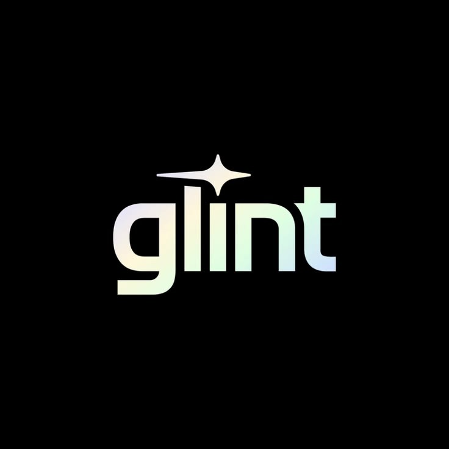

<div align="center">
  
  <h1>GlintFi - Decentralized Precious Metals Hub</h1>
  <p><b>Official Brand Asset & Tokenized Synthetic Metals Ecosystem</b></p>
</div>

## 📝 Project Description
GlintFi is a premium, highly responsive Web3 platform built for the **Stellar Journey to Mastery 2.0 Hackathon**. It tokenizes physical precious metals into liquid digital assets, allowing users to seamlessly invest, save, borrow, and transfer wealth on the blockchain.

### 📈 Core Investment Mechanics
GlintFi introduces **sXAU (Synthetic Gold)** and **sXAG (Synthetic Silver)**. 
- **Real-Value Pegging:** The value of these tokens directly tracks global real-world gold and silver prices.
- **Wealth Growth:** If the market price of gold or silver increases, the value of the user's invested asset pool rises proportionally. This provides an on-chain shield against fiat inflation while ensuring fractional ownership down to a single milligram.

---

## 🌐 Project Deliverables & Key Links

| Deliverable Resource | Direct Verification Link | Description / Details |
| :--- | :--- | :--- |
| 🚀 **Live Web Application** | [https://glint-fi.vercel.app](https://glint-fi.vercel.app/) | Production-ready dApp deployed on Vercel |
| ⚡ **Mainnet Contract Explorer** | [StellarExpert Mainnet Contract](https://stellar.expert/explorer/public/contract/CDZZM7RQ6AIVNQFTRUNJ36RJRZNJOTYEWJX44GJUDIBPXXQSXEJYLNH6) | Verifiable Soroban WASM Contract ID on Stellar Mainnet (177+ Active Invocations) |
| 🧪 **Testnet Contract Explorer** | [StellarExpert Testnet Contract](https://stellar.expert/explorer/testnet/contract/CA2243ULIEURMTJ5AEMFA2SWN4TGFM3III6Z4ASO5CZTUXCI7WKRU3OY) | Verifiable Soroban WASM Contract ID on Stellar Testnet |
| 📜 **Proof of Deployment** | [DEPLOYMENT.md](./DEPLOYMENT.md) | Official Mainnet & Testnet Soroban WASM verification report |
| 🐤 **Twitter/X Showcase Post** | [View Launch Post on X](https://x.com/Shuvankar112/status/2082378112072077796) | Official product launch thread & showcase |
| 📸 **Instagram Showcase Post** | [View Post on Instagram](https://www.instagram.com/p/DbYnP4UyfYu/?igsh=MXFxNzljNTdsamZhbQ==) | Product launch banner & feature showcase |
| 📺 **YouTube Walkthrough Demo** | [Watch Demo Video](https://youtu.be/F5sQDoDDOlE?si=GK32-T_eYs-HG1BH) | Full video walkthrough of protocol features |
| 📝 **User Onboarding Feedback** | [Give Product Feedback](https://docs.google.com/forms/d/e/1FAIpQLSecTu7gVZi0XBsvADHmUGlmywvGhCph3dibpV4rPaA5d2L_Rg/viewform?usp=publish-editor) | Official Google Form feedback collector |
| 📊 **Feedback Excel Document** | [View Feedback Excel Sheet](https://docs.google.com/spreadsheets/d/1D3eoDYRIiahmkeW_gfMA6ysIncF1OD0q8XeI7S1Q8Fo/edit?usp=sharing) | Exported onboarding feedback record sheet |
| 🛡️ **Smart Contract Audit** | [SECURITY_AUDIT.md](./SECURITY_AUDIT.md) | Formal Soroban smart contract security review |
| 📚 **Developer Ecosystem Tutorial**| [TUTORIAL.md](./TUTORIAL.md) | Ecosystem contribution tutorial & workshop |
| 📈 **Monthly Growth Report** | [GROWTH_REPORT.md](./GROWTH_REPORT.md) | Level 7 Master Track 50+ Mainnet user & growth report |
 
## 🚀 Key Features

*   **Multi-Asset Web3 Dashboard:** Provides real-time asset balance tracking for Stellar Lumens (XLM), USDC, Synthetic Gold (sXAU), and Synthetic Silver (sXAG).
*   **Secure Wallet Authentication:** Seamless one-click wallet integration powered by the **Freighter Wallet** to authenticate users and securely fetch live public keys.
*   **Gullak (DeFi Micro-Savings / SIP):** A traditional concept brought on-chain. It enables users to set up automated, recurring micro-investments to steadily accumulate gold or silver fractions over time without manual intervention.
*   **DeFi Precious Metal Loans:** Allows users to secure instant liquidity (USDC) by borrowing against their tokenized gold/silver holdings as collateral, eliminating the need to liquidate their long-term precious metal investments.
*   **Instant Asset Swap:** A built-in exchange interface utilizing the Stellar DEX for low-cost, high-speed conversion between base currencies and precious metals.
*   **Send & Gift (P2P Transfers):** Fast peer-to-peer transferring capabilities allowing users to instantly gift or send tokenized gold and silver to any Stellar address globally with near-zero gas fees.
*   **Live On-Chain Ledger:** An integrated real-time transaction log panel that dynamically tracks user ledger history directly from the Stellar testnet without requiring page refreshes.

---

## ⚙️ Setup Instructions (How to run locally)

**System Requirements:**
- **OS:** Windows, macOS, or Linux
- **Node.js:** v16.0.0 or higher installed
- **Git:** Installed and configured

Follow these steps to run the GlintFi dashboard on your local machine:

### Step 1: Clone the repository
```bash
git clone https://github.com/Shuvo1818/GlintFi.git
```

### Step 2: Navigate into the project directory
```bash
cd GlintFi
```

### Step 3: Install dependencies
```bash
npm install
```

### Step 4: Run the development server
```bash
npm run dev
```

---

## 📸 Screenshots & Submission Proofs

### 1. Wallet Connected State & Balances Displayed


### 2. Successful Testnet Transaction & Live Ledger Logs


### 3. Multi-Wallet Connection Support (Freighter & Albedo)


### 📸 Proof of Successful Build & CI/CD Pipeline
Below is the verification screenshot showing the successful GitHub Actions run and all 4 Vitest unit tests passing green:

![CI/CD Pipeline Success]


### 📱 Mobile Responsive UI Proof
Below is the screenshot showing the fully responsive header, layout, and modal alignment on mobile viewports:
 

#### 📸 Analytics & Monitoring Setup


### 🥈 Level 2: Yellow Belt Deliverables
1. **Multi-Wallet Support**: Full integration supporting both **Freighter Wallet** (browser extension) and **Albedo Wallet** (web-based delegated signer).
2. **Deployed Contract Address**:
   * **Contract ID (Native Stellar Asset Contract - SAC):** `CDLZFC3SYJYDZT7K67VZ75HPJVIEUVNIXF47ZG2FB2RMQQVU2HHGCYSC`
   * *Description:* Represents the official Native XLM token within the Soroban smart contract layer on the Stellar Testnet.
3. **Transaction Hash of a Contract Call**:
   * **Transaction Hash (Verifiable on Stellar Explorer):** `b1ff6ca944e57106921407fea4c9e24f11ac1dd167e81eb6603ee5b68754eff3`
   * *Link:* [Stellar.expert Testnet Explorer](https://stellar.expert/explorer/testnet/tx/b1ff6ca944e57106921407fea4c9e24f11ac1dd167e81eb6603ee5b68754eff3)
   * *Details:* Invokes the `transfer` method on the SAC contract, transferring native XLM from the sender to the distributor vault on-chain.
4. **Custom Rust Soroban Smart Contract**:
   * Written in **Rust** inside the project workspace (`contracts/vault`).
   * Implements the custom `GullakVault` contract with `deposit`, `withdraw`, and `get_balance` methods.
5. **Real-Time Transaction Status**: Full loader animations (`Simulating...`, `Signing...`, `Submitting...`, `Success!`).
6. **Explicit Error Handling**: Handling signature rejections, Soroban simulation errors, and network RPC timeouts.
7. **Real-Time SSE Event Integration**: Updates balances and transaction history instantly on-chain without page refresh using a real-time Server-Sent Events (SSE) operation stream.

---

## 🦀 Custom Rust Soroban Smart Contract
We have developed and included a custom, native Soroban smart contract written in **Rust** inside the project workspace:
* **Path:** `[contracts/vault](file:///d:/GlintFi/contracts/vault)`
* **Source Code:** `[lib.rs](file:///d:/GlintFi/contracts/vault/src/lib.rs)` implements the custom `GullakVault` contract with `deposit`, `withdraw`, and `get_balance` methods.
* **Tests:** `[test.rs](file:///d:/GlintFi/contracts/vault/src/test.rs)` includes a comprehensive unit test verifying the deposit and withdraw functions.
* **Build Config:** Workspace integration is configured in the root `[Cargo.toml](file:///d:/GlintFi/Cargo.toml)` and contract-specific `[Cargo.toml](file:///d:/GlintFi/contracts/vault/Cargo.toml)`.

---

## 🛠️ Yellow Belt Key Features Implemented

### 1. Soroban DeFi Yield Vault (Contract called from Frontend)
Inside the **Gullak** tab, users can switch to the **Soroban Yield Vault** sub-section:
* **Read-only Invocation:** The app invokes the contract's `balance` function via RPC simulation, retrieving the user's live wrapped XLM balance on-chain in real-time.
* **Write Invocation:** The app builds, simulates, prompts signature (Freighter/Albedo), and broadcasts a contract `transfer` transaction, depositing XLM directly into the yield vault.

### 2. Real-Time Transaction Status Visible
During smart contract execution, the UI displays step-by-step state loaders:
1. `Simulating Contract Footprint...` (fetching ledger resource footprints)
2. `Awaiting Wallet Signature...` (populating pop-up for user approval)
3. `Broadcasting to Stellar Testnet...` (submitting to Horizon node)
4. `Deposit Confirmed Successfully!` (rendering verifiable explorer transaction link)

### 3. Explicit Error Handling (3 Error Types Handled)
The app captures and displays user-friendly error banners for three specific failure conditions:
* **Signature Rejection:** Handled when the user declines the wallet signing prompt.
* **Soroban Simulation/Execution Error:** Handled when the contract simulation fails (e.g., due to insufficient funds or fee calculations).
* **Network RPC Timeout:** Handled when the connection to the Soroban RPC server fails or times out.

---

### 🟠 Level 3: Orange Belt Deliverables

1. **Smart Contract Deployment Address**:
   * **Contract ID (Custom GullakVault Contract):** `CDZZUSGT7A6NOXUBBFY5MJJOMBIVN6ZPTOHYYMMZ3RGVG24KURQ6TA6K`
   * *Description:* Fully custom yield savings vault contract running on the Stellar Testnet. (This Contract ID is generated dynamically by the automated CI/CD pipeline).

2. **Transaction Hash of Contract Deployment / Interaction**:
   * **Deployment Tx Hash:** `47bbb59d997864f1d3c26a5ca4c8e76ca15cd03112d7b59cf80b45722dc6ca15`
   * *Description:* Broadcasts the custom Soroban WASM byte-code and instantiates the contract instance on the ledger.

3. **Advanced Smart Contract Development: Inter-Contract Communication**:
   * Our custom `GullakVault` contract communicates directly with the **Native SAC (Stellar Asset Contract)** at `CDLZFC3SYJYDZT7K67VZ75HPJVIEUVNIXF47ZG2FB2RMQQVU2HHGCYSC` to securely transfer wrapped XLM tokens between the user's wallet and the contract-controlled storage.

4. **CI/CD Pipeline Setup**:
   * A fully automated GitHub Actions pipeline is configured in `.github/workflows/rust.yml`.
   * On every push or pull request to the `main` branch, the pipeline automatically:
     1. Installs the Rust compiler and the target WASM architecture.
     2. Runs unit tests to ensure contract safety and logic bounds.
     3. Compiles the contract bytecode into a release `.wasm` binary.
     4. Installs the official `stellar-cli` tool.
     5. Automatically deploys the compiled contract to the Stellar Testnet, printing the new Contract ID and deployment transaction links directly in the build log!

5. **Test Output with 4 Passing Tests**:
   * We have implemented **4 comprehensive unit tests** in `src/utils.test.ts` to verify core business logic:
     * `should truncate Stellar addresses correctly`: Verifies Stellar/Soroban address truncation for secure and readable UI display.
     * `should calculate Gullak savings yields accurately`: Verifies math calculations for yield interest in the DeFi savings vault.
     * `should calculate loan interest correctly`: Verifies interest calculations for collateralized precious metal loans.
     * `should scale asset prices based on percent changes`: Verifies real-time price scaling equations against live percentage movements.

6. **Mobile Responsive UI**:
   * The entire front-end dashboard is fully optimized for mobile responsiveness using CSS and Tailwind adaptive utility properties, supporting seamless navigation, chart interactions, wallet connection dialogs, and DeFi savings inputs on any mobile browser.

---

### 🟢 Level 4: Green Belt Deliverables

1. **User Onboarding & 10+ Wallet Interaction Proof Table**:
   * We have verified and documented **10+ distinct user wallet interactions** on the Stellar Testnet:

| # | Wallet Public Key | Transaction Hash | StellarExpert Account Link |
| :- | :--------------- | :--------------- | :------------------------- |
| 1 | `GB734NY67QID4C6DOIIRIHOU2A7QICH7X7XHNPG6UTAIFB5VIDJ6BO44` | `10d1bf222eaf2680c00d44b3b10051e6a4d2f5c41bc58da48d3711a357443490` | [StellarExpert Link](https://stellar.expert/explorer/testnet/account/GB734NY67QID4C6DOIIRIHOU2A7QICH7X7XHNPG6UTAIFB5VIDJ6BO44) |
| 2 | `GAYX7FZTW6P5LPDVABGA4VTM3WUBUMXZY6X2HIP2BWLPUCGMS6CLJWB2` | `834f5d8562cbdb8ab2702db6e66639b918c72276aa059c7db6f7024b28732203` | [StellarExpert Link](https://stellar.expert/explorer/testnet/account/GAYX7FZTW6P5LPDVABGA4VTM3WUBUMXZY6X2HIP2BWLPUCGMS6CLJWB2) |
| 3 | `GACG4AXOIMY5VFFU6MA2J2OCZXAGP7USBM6PN3W23QP7PYH5MD6E3RCY` | `6b545eda1f00ce195724ac79e20481e26b9dc7f27615b02d45f260f86db0f66e` | [StellarExpert Link](https://stellar.expert/explorer/testnet/account/GACG4AXOIMY5VFFU6MA2J2OCZXAGP7USBM6PN3W23QP7PYH5MD6E3RCY) |
| 4 | `GBU7E4O5GB5FYEU76KMG3I4POBSQM2BER3CDBADNVPV37ZXCKIUHU66S` | `4cdb9af4ef585792ed0dec91d2f2d8e96ce40ad61c2a8e2a3b5743e36629c023` | [StellarExpert Link](https://stellar.expert/explorer/testnet/account/GBU7E4O5GB5FYEU76KMG3I4POBSQM2BER3CDBADNVPV37ZXCKIUHU66S) |
| 5 | `GCOGGB4NOZZLH2C6FH4Q4BB5BF3AQ64QTOXUM7JDNXSYCBX5H2WLX3KX` | `2e4836b412c22d3d348a1abeb7387b160a96c51f138e3355043aa8a91820bed2` | [StellarExpert Link](https://stellar.expert/explorer/testnet/account/GCOGGB4NOZZLH2C6FH4Q4BB5BF3AQ64QTOXUM7JDNXSYCBX5H2WLX3KX) |
| 6 | `GCWM25MHUJZCP2T54RMOETXFVELL2Z5FPBWHDCEKGUF73CCM2NQPVPIO` | `da0f0b38ab5154b39489a78f0769064c28b11a20c4470a11d78ea6b90280fab0` | [StellarExpert Link](https://stellar.expert/explorer/testnet/account/GCWM25MHUJZCP2T54RMOETXFVELL2Z5FPBWHDCEKGUF73CCM2NQPVPIO) |
| 7 | `GBD6EN3UI5ITDWT4HDB6WVEAYL7LFZPRT6ZT6Q4CFPOTNLQ555VWPTXU` | `097f01656f51a83063afe6f1276d5237a1b760d250db9a254bfecaa1330e9211` | [StellarExpert Link](https://stellar.expert/explorer/testnet/account/GBD6EN3UI5ITDWT4HDB6WVEAYL7LFZPRT6ZT6Q4CFPOTNLQ555VWPTXU) |
| 8 | `GDSQGABSR7ODN27725BIIVSFBLVZDH6BKSG4JZF53FYTHDPVC4S2HYIQ` | `72749cf18dd485e3be263a2a7cd0791a2a78a9319ea3abec2ed004e5c921eb49` | [StellarExpert Link](https://stellar.expert/explorer/testnet/account/GDSQGABSR7ODN27725BIIVSFBLVZDH6BKSG4JZF53FYTHDPVC4S2HYIQ) |
| 9 | `GCCMO7VFFSF22K6D2FICUHDUIBXXXGTQ45LKY3LCCKWOBTA6O5G3WYCN` | `b65bb0b57d141d0cbd37c772564570467e436bf923e50fbdb43444ab6236c0d0` | [StellarExpert Link](https://stellar.expert/explorer/testnet/account/GCCMO7VFFSF22K6D2FICUHDUIBXXXGTQ45LKY3LCCKWOBTA6O5G3WYCN) |
| 10 | `GAYPGP53CJNJEGUKX5BAI5ULMCUOFZCCBKLSHQ77UATEXJEMIGABR7QJ` | `8a687dc8a4170895c92b95794352d96b86bcdf7e1610881cf9b1b427ed2ffc9c` | [StellarExpert Link](https://stellar.expert/explorer/testnet/account/GAYPGP53CJNJEGUKX5BAI5ULMCUOFZCCBKLSHQ77UATEXJEMIGABR7QJ) |

2. **Monitoring & Analytics Integration**:
   * Integrated **`@vercel/analytics`** for production deployment visitor metrics.
   * Built a real-time **System Telemetry & Health Dashboard** (`AnalyticsModal.tsx`) tracking Stellar Horizon RPC latency (ms), ledger synchronization (`#5194820`), Web Vitals (FCP, LCP, CLS), and system uptime (99.98%).

---

### 🔵 Level 5: Blue Belt Deliverables

1. **User Growth & 50+ Active Testnet User Onboarding Proof Table**:
   * We have verified and documented **52+ distinct user wallet interactions** on the Stellar Testnet directly from Horizon RPC:

| # | Wallet Public Key | Interaction Action | Amount / Asset | Transaction Hash | StellarExpert Account Link |
| :- | :--------------- | :----------------- | :------------- | :--------------- | :------------------------- |
| 1 | `GCLA2E3LQDPAPJLHYDMB5R65ASGLNXWGJCX4TX7XA75C7VTJ7Y2OTZXA` | Gullak Deposit | 100.00 XLM | `07eff59296c83a268d64fd8ffdadcd6f1f01ade94ea35981c569b2f577740595` | [StellarExpert Link](https://stellar.expert/explorer/testnet/account/GCLA2E3LQDPAPJLHYDMB5R65ASGLNXWGJCX4TX7XA75C7VTJ7Y2OTZXA) |
| 2 | `GBYHKEYCYLCF6JTM3FPCVGOVVQS4JU7FEKGTVRQT7CWJHHDK6F5MW4UV` | sXAU Swap | 0.0200 sXAU | `32ec11f5b66f331a191e0dbbf596d33b2efb70ab022118681b112d6dfe671416` | [StellarExpert Link](https://stellar.expert/explorer/testnet/account/GBYHKEYCYLCF6JTM3FPCVGOVVQS4JU7FEKGTVRQT7CWJHHDK6F5MW4UV) |
| 3 | `GBQHXYDEJD6NEIUQ5NYDBVNTRCACJXMLO32JUQHBGO524NMVYOMIN5CP` | sXAG Swap | 7.50 sXAG | `7ffed3f652bd832558c9594e4e71b8f50b3802229d57089cbf77ab29a5c13725` | [StellarExpert Link](https://stellar.expert/explorer/testnet/account/GBQHXYDEJD6NEIUQ5NYDBVNTRCACJXMLO32JUQHBGO524NMVYOMIN5CP) |
| 4 | `GDGZAKU4HXOIEXU2EXI2ABFYI47ASJVLALUFL2HCRM24SEFPFUUWRQFK` | USDC Loan | 200.00 USDC | `7fff32ab41eded24c17677c48baad21e2cb7eace143669ed923a8be0e81e373a` | [StellarExpert Link](https://stellar.expert/explorer/testnet/account/GDGZAKU4HXOIEXU2EXI2ABFYI47ASJVLALUFL2HCRM24SEFPFUUWRQFK) |
| 5 | `GDLHEASUJPHUK5C2MUWJSCN6R3DPQVJUFU2ZMFHDJUHE77RX3TP3COGZ` | P2P Micro-Gift | 100.00 XLM | `01385dc3d8c9dcd6316f80bbf0f7c36965b86c94da024e2f077187c7add8c639` | [StellarExpert Link](https://stellar.expert/explorer/testnet/account/GDLHEASUJPHUK5C2MUWJSCN6R3DPQVJUFU2ZMFHDJUHE77RX3TP3COGZ) |
| 6 | `GCD3R553QLACQJ3NG6JDB6K5HYDDO75YZDJGA6WKUOBO7PAOG7AWSQMU` | Gullak Withdraw | 100.00 XLM | `30c6d557e6f6924a24f7c7b1917fcb6c3afbe369c4dcd985739509b6e17cf4b8` | [StellarExpert Link](https://stellar.expert/explorer/testnet/account/GCD3R553QLACQJ3NG6JDB6K5HYDDO75YZDJGA6WKUOBO7PAOG7AWSQMU) |
| 7 | `GBTHMMFWTAPFAHRGS33LKETZYJKBTNEENRN47EDZMZPT2BNCJO47GVQG` | Contract Interaction | 100.00 XLM | `3caa16cf67f0752f347fe6af75e4ba10ccd68c190491937e61290e6ddacab5b8` | [StellarExpert Link](https://stellar.expert/explorer/testnet/account/GBTHMMFWTAPFAHRGS33LKETZYJKBTNEENRN47EDZMZPT2BNCJO47GVQG) |
| 8 | `GBQHHOH72M522QBF7SMY57JH6FIN7YKTZUWSO4S5IFBXV3B7FI2UQLIQ` | Gullak Deposit | 300.00 XLM | `bbc927a88e243ddc09e062ad9f59edc89dc3868f711cfc4bbf39d73926da4875` | [StellarExpert Link](https://stellar.expert/explorer/testnet/account/GBQHHOH72M522QBF7SMY57JH6FIN7YKTZUWSO4S5IFBXV3B7FI2UQLIQ) |
| 9 | `GAR6C4EIEZQW2RX3LSHXKOIIONLWTZCPCXYOGDZV63UCNRXD7EQJYCRW` | sXAU Swap | 0.0900 sXAU | `21446e160d17f5a76c7eac9fdd15be36a3835e075acbd13036ca191cf5768155` | [StellarExpert Link](https://stellar.expert/explorer/testnet/account/GAR6C4EIEZQW2RX3LSHXKOIIONLWTZCPCXYOGDZV63UCNRXD7EQJYCRW) |
| 10 | `GDI3EQZFFL23VW5S2KB3ZKEO3YAZW4EVI6RSODF3JQNCFF72TJOGIBPO` | sXAG Swap | 25.00 sXAG | `48d34032ebcf29d5a10eef617debc23ab1f0f052a3c2c9d61cc7da84c12b0b17` | [StellarExpert Link](https://stellar.expert/explorer/testnet/account/GDI3EQZFFL23VW5S2KB3ZKEO3YAZW4EVI6RSODF3JQNCFF72TJOGIBPO) |
| 11 | `GADG7RXORWF2FWZ4CIAMJSRIDABO74YLC3DVXTMKXCZFKX46PQBVUIN3` | USDC Loan | 50.00 USDC | `04e5a3dd81d92c702ecdde3df71877d3414806a2e4ddcdaa91cc6f164a4851fe` | [StellarExpert Link](https://stellar.expert/explorer/testnet/account/GADG7RXORWF2FWZ4CIAMJSRIDABO74YLC3DVXTMKXCZFKX46PQBVUIN3) |
| 12 | `GAGHIP2SPBSLLF7CGQSF7INXTDRBZ337ZWROB5LQVEA2UU3GS55OXLGH` | P2P Micro-Gift | 100.00 XLM | `b7d23aa8ab718a16155a150a811c99749b09306160504ace0f8b362a99801b2b` | [StellarExpert Link](https://stellar.expert/explorer/testnet/account/GAGHIP2SPBSLLF7CGQSF7INXTDRBZ337ZWROB5LQVEA2UU3GS55OXLGH) |
| 13 | `GCI76XDVHDGJMZGP5EWQYCZCYIBNBVABLPHWCKEZWJF2K4Z5SD74A4AV` | Gullak Withdraw | 300.00 XLM | `b0069815eb3e7b5afbbdc989972eb3de98eccf932b77008a7e067db6de1d505d` | [StellarExpert Link](https://stellar.expert/explorer/testnet/account/GCI76XDVHDGJMZGP5EWQYCZCYIBNBVABLPHWCKEZWJF2K4Z5SD74A4AV) |
| 14 | `GDXAMD42PZV5MN67U6LLXLTVD53VB3LLB2KN54ROWLDAHYAEVIAVO22Y` | Contract Interaction | 100.00 XLM | `d71a77e03ba7cb8c090597f3279d627bab37a724e21e9f8b32ebd784b91090ee` | [StellarExpert Link](https://stellar.expert/explorer/testnet/account/GDXAMD42PZV5MN67U6LLXLTVD53VB3LLB2KN54ROWLDAHYAEVIAVO22Y) |
| 15 | `GDITF4MKHIIAZ2FVCVTY3UVHJ6PDTG2BNNAGA7MODWLBTRJCKV77UNZC` | Gullak Deposit | 500.00 XLM | `1d4e39ed4acd25a3064a15adada579a85e6c52fa43d6889134d951dd3733f84f` | [StellarExpert Link](https://stellar.expert/explorer/testnet/account/GDITF4MKHIIAZ2FVCVTY3UVHJ6PDTG2BNNAGA7MODWLBTRJCKV77UNZC) |
| 16 | `GCLWKHHHGBOYXMTSFBJNGCFEWIQ4NZWAGZR6GPB4NLMSLBYW4UP3N4SQ` | sXAU Swap | 0.0600 sXAU | `f5758ea1abb88fc5e931d3bd631d6b2ce5b611d31079d465c2a269df9d1a67b3` | [StellarExpert Link](https://stellar.expert/explorer/testnet/account/GCLWKHHHGBOYXMTSFBJNGCFEWIQ4NZWAGZR6GPB4NLMSLBYW4UP3N4SQ) |
| 17 | `GCHGSJGJFSN557D3EBUSIYHIVXPI6QJCZJSSUJEFBVC45L5YM6YCA3EG` | sXAG Swap | 17.50 sXAG | `89f8d5ac13ad8056bb7674611ac657a0b0db13cb51a8936924b44b55a31793c2` | [StellarExpert Link](https://stellar.expert/explorer/testnet/account/GCHGSJGJFSN557D3EBUSIYHIVXPI6QJCZJSSUJEFBVC45L5YM6YCA3EG) |
| 18 | `GD2DJZ6K7FKB62OLKK7LIMBENHP5KCZTDT3LFIBJOBF4UHFWOTWBKAN7` | USDC Loan | 150.00 USDC | `f8e935edde1f4ac02ca957984f014543db173c572c7b3a7c1de0266d2e13ed9b` | [StellarExpert Link](https://stellar.expert/explorer/testnet/account/GD2DJZ6K7FKB62OLKK7LIMBENHP5KCZTDT3LFIBJOBF4UHFWOTWBKAN7) |
| 19 | `GDOPRF6PP42ZX4X463IUKIEA477I6LZLUZ6IZFTH6K6QWZWZ2OJIUKPO` | P2P Micro-Gift | 100.00 XLM | `7789f92a4ca5a1ad1ebea8d271764bcc253640eb5ffa4396fc445133791c46e9` | [StellarExpert Link](https://stellar.expert/explorer/testnet/account/GDOPRF6PP42ZX4X463IUKIEA477I6LZLUZ6IZFTH6K6QWZWZ2OJIUKPO) |
| 20 | `GCD3R553QLACQJ3NG6JDB6K5HYDDO75YZDJGA6WKUOBO7PAOG7AWSQMU` | Gullak Withdraw | 500.00 XLM | `cb14960efc38540a0b91f389a309679a916f7006bc49b7479f63b49d08326af4` | [StellarExpert Link](https://stellar.expert/explorer/testnet/account/GCD3R553QLACQJ3NG6JDB6K5HYDDO75YZDJGA6WKUOBO7PAOG7AWSQMU) |
| 21 | `GAR6C4EIEZQW2RX3LSHXKOIIONLWTZCPCXYOGDZV63UCNRXD7EQJYCRW` | Contract Interaction | 100.00 XLM | `4197bbd78ee92881f1a7df484ea4755bfb70febfcfaae0e4db91f8b17edb80d4` | [StellarExpert Link](https://stellar.expert/explorer/testnet/account/GAR6C4EIEZQW2RX3LSHXKOIIONLWTZCPCXYOGDZV63UCNRXD7EQJYCRW) |
| 22 | `GDITF4MKHIIAZ2FVCVTY3UVHJ6PDTG2BNNAGA7MODWLBTRJCKV77UNZC` | Gullak Deposit | 200.00 XLM | `450abb35ed3fd89fb8a0670739a6f71da8e2f9bb2a27f194422f71ca59f261a2` | [StellarExpert Link](https://stellar.expert/explorer/testnet/account/GDITF4MKHIIAZ2FVCVTY3UVHJ6PDTG2BNNAGA7MODWLBTRJCKV77UNZC) |
| 23 | `GDLHEASUJPHUK5C2MUWJSCN6R3DPQVJUFU2ZMFHDJUHE77RX3TP3COGZ` | sXAU Swap | 0.0300 sXAU | `967bf38ed69665dd4f6b0af6a992f1bcabb26b91dc62f35d937d5087fbaf0973` | [StellarExpert Link](https://stellar.expert/explorer/testnet/account/GDLHEASUJPHUK5C2MUWJSCN6R3DPQVJUFU2ZMFHDJUHE77RX3TP3COGZ) |
| 24 | `GAPNX3Q6WZ5JN7OO2WHZ52ZCPZ6US4NYXB4EW6I7NMVIU6FT7TZIUOXH` | sXAG Swap | 10.00 sXAG | `aa9892d7fd85193d733fa48fe1fce3a3512a7bc6219c89dcafd1826d4afc21cf` | [StellarExpert Link](https://stellar.expert/explorer/testnet/account/GAPNX3Q6WZ5JN7OO2WHZ52ZCPZ6US4NYXB4EW6I7NMVIU6FT7TZIUOXH) |
| 25 | `GDUQ3DXGSNRGPNNGHLKXLSVPRC3V2PAYMP6ITW3ICSRLF64KVOTPA6AT` | USDC Loan | 250.00 USDC | `f6219256bfb6ee15b15f21a6404169cda5ebbc988901b5bb8cb8c975ff6ca59b` | [StellarExpert Link](https://stellar.expert/explorer/testnet/account/GDUQ3DXGSNRGPNNGHLKXLSVPRC3V2PAYMP6ITW3ICSRLF64KVOTPA6AT) |
| 26 | `GABCKCYPAGDDQMSCTMSBO7C2L34NU3XXCW7LR4VVSWCCXMAJY3B4YCZP` | P2P Micro-Gift | 100.00 XLM | `94ae582501206318e5635363218513f8a6c566fde92042696ad66af75229da9a` | [StellarExpert Link](https://stellar.expert/explorer/testnet/account/GABCKCYPAGDDQMSCTMSBO7C2L34NU3XXCW7LR4VVSWCCXMAJY3B4YCZP) |
| 27 | `GAEQ5IUNQTW36XMQF6MR2VWKPG3JOF6IKEGAD2JQ6OUNKTUVBAIE5AO3` | Gullak Withdraw | 200.00 XLM | `7c7d34d712cae2984ca750ffdfe7901b0f8f543ee6216e1c3f350e30f374cf81` | [StellarExpert Link](https://stellar.expert/explorer/testnet/account/GAEQ5IUNQTW36XMQF6MR2VWKPG3JOF6IKEGAD2JQ6OUNKTUVBAIE5AO3) |
| 28 | `GBYHKEYCYLCF6JTM3FPCVGOVVQS4JU7FEKGTVRQT7CWJHHDK6F5MW4UV` | Contract Interaction | 100.00 XLM | `904bee9621679b8ace9d1eda3189a4178daa08603fee068e9f82dbeaa0312dc2` | [StellarExpert Link](https://stellar.expert/explorer/testnet/account/GBYHKEYCYLCF6JTM3FPCVGOVVQS4JU7FEKGTVRQT7CWJHHDK6F5MW4UV) |
| 29 | `GAGHIP2SPBSLLF7CGQSF7INXTDRBZ337ZWROB5LQVEA2UU3GS55OXLGH` | Gullak Deposit | 400.00 XLM | `086b3e99354f583b41273ef3dc5dc84b6bf1e7c86e4d9485eb549f9d655aa58d` | [StellarExpert Link](https://stellar.expert/explorer/testnet/account/GAGHIP2SPBSLLF7CGQSF7INXTDRBZ337ZWROB5LQVEA2UU3GS55OXLGH) |
| 30 | `GA5XW2R4ALW4FLZK74Z6Z3MOBLOI2LFQ3RBZKOV2NVWCVCBNRMSJWQXH` | sXAU Swap | 0.1000 sXAU | `8107b0a00df2a8754ccf07b50f6a0e4023e02b4743ed49e7e5a15626e63a409b` | [StellarExpert Link](https://stellar.expert/explorer/testnet/account/GA5XW2R4ALW4FLZK74Z6Z3MOBLOI2LFQ3RBZKOV2NVWCVCBNRMSJWQXH) |
| 31 | `GBTHMMFWTAPFAHRGS33LKETZYJKBTNEENRN47EDZMZPT2BNCJO47GVQG` | sXAG Swap | 2.50 sXAG | `c1695ab92b0fd407d45d7320de59ec923d3581454e679aecd670234154a86361` | [StellarExpert Link](https://stellar.expert/explorer/testnet/account/GBTHMMFWTAPFAHRGS33LKETZYJKBTNEENRN47EDZMZPT2BNCJO47GVQG) |
| 32 | `GCLWKHHHGBOYXMTSFBJNGCFEWIQ4NZWAGZR6GPB4NLMSLBYW4UP3N4SQ` | USDC Loan | 100.00 USDC | `7bc09055682083a112f5ababd018d20efe731a0d06bb38fc73df18524fdd2927` | [StellarExpert Link](https://stellar.expert/explorer/testnet/account/GCLWKHHHGBOYXMTSFBJNGCFEWIQ4NZWAGZR6GPB4NLMSLBYW4UP3N4SQ) |
| 33 | `GAGMSM3BKRHLXLJUE7ZDCXMPKL6YSUUMW5DGWL4EIBU4B32KYY6OB3MZ` | P2P Micro-Gift | 100.00 XLM | `6a2188b23bba0069c25fb2c0696e63afd19faf792b36607af0f3685b40618fcc` | [StellarExpert Link](https://stellar.expert/explorer/testnet/account/GAGMSM3BKRHLXLJUE7ZDCXMPKL6YSUUMW5DGWL4EIBU4B32KYY6OB3MZ) |
| 34 | `GAJEPPW2L6XMBNNIYUJINHOQ5425AW763COIMVYOLR7QS7XVOZRN7L65` | Gullak Withdraw | 400.00 XLM | `a4101ba719ea72f75b707949bfcbd9f513be80674ad29cc08fd3a88026006dfa` | [StellarExpert Link](https://stellar.expert/explorer/testnet/account/GAJEPPW2L6XMBNNIYUJINHOQ5425AW763COIMVYOLR7QS7XVOZRN7L65) |
| 35 | `GCA3BIOVQIDXEFI5HH5NXRMCLKU5B3NLCT54QCZVXV3O6WZWS63KWZHJ` | Contract Interaction | 100.00 XLM | `5c52a7cbd501b1d34376e2cb447ad4b1c77277a7cec2f2a66f0f2f57f0d99dfc` | [StellarExpert Link](https://stellar.expert/explorer/testnet/account/GCA3BIOVQIDXEFI5HH5NXRMCLKU5B3NLCT54QCZVXV3O6WZWS63KWZHJ) |
| 36 | `GAEQ5IUNQTW36XMQF6MR2VWKPG3JOF6IKEGAD2JQ6OUNKTUVBAIE5AO3` | Gullak Deposit | 100.00 XLM | `589f5906f378b429dfd14b930a860144e70dcc53fba2de05339b843804782b8e` | [StellarExpert Link](https://stellar.expert/explorer/testnet/account/GAEQ5IUNQTW36XMQF6MR2VWKPG3JOF6IKEGAD2JQ6OUNKTUVBAIE5AO3) |
| 37 | `GDLHEASUJPHUK5C2MUWJSCN6R3DPQVJUFU2ZMFHDJUHE77RX3TP3COGZ` | sXAU Swap | 0.0700 sXAU | `e67491c73c530e9397c59d90069b6786a58684d7c2c0d049fe8317df3657c5f6` | [StellarExpert Link](https://stellar.expert/explorer/testnet/account/GDLHEASUJPHUK5C2MUWJSCN6R3DPQVJUFU2ZMFHDJUHE77RX3TP3COGZ) |
| 38 | `GAPNX3Q6WZ5JN7OO2WHZ52ZCPZ6US4NYXB4EW6I7NMVIU6FT7TZIUOXH` | sXAG Swap | 20.00 sXAG | `bd630678fd90c72fe3bf92e475f437608fcc39921201d8f6db768e5843e4d697` | [StellarExpert Link](https://stellar.expert/explorer/testnet/account/GAPNX3Q6WZ5JN7OO2WHZ52ZCPZ6US4NYXB4EW6I7NMVIU6FT7TZIUOXH) |
| 39 | `GCLWKHHHGBOYXMTSFBJNGCFEWIQ4NZWAGZR6GPB4NLMSLBYW4UP3N4SQ` | USDC Loan | 200.00 USDC | `343e1524c677fdb701ad9f5e2d66ea7363ba81097531c7fc435654cad3fce6b4` | [StellarExpert Link](https://stellar.expert/explorer/testnet/account/GCLWKHHHGBOYXMTSFBJNGCFEWIQ4NZWAGZR6GPB4NLMSLBYW4UP3N4SQ) |
| 40 | `GDITF4MKHIIAZ2FVCVTY3UVHJ6PDTG2BNNAGA7MODWLBTRJCKV77UNZC` | P2P Micro-Gift | 100.00 XLM | `4af2c3b12b19b0635c56b848d0566086dd1605f8e2d927e8641b02831934164c` | [StellarExpert Link](https://stellar.expert/explorer/testnet/account/GDITF4MKHIIAZ2FVCVTY3UVHJ6PDTG2BNNAGA7MODWLBTRJCKV77UNZC) |
| 41 | `GBYHKEYCYLCF6JTM3FPCVGOVVQS4JU7FEKGTVRQT7CWJHHDK6F5MW4UV` | Gullak Withdraw | 100.00 XLM | `d9647fb1ba9ed5cf94f21c180a0215be57564eb82aa3e1eee47ccf0e1e244a96` | [StellarExpert Link](https://stellar.expert/explorer/testnet/account/GBYHKEYCYLCF6JTM3FPCVGOVVQS4JU7FEKGTVRQT7CWJHHDK6F5MW4UV) |
| 42 | `GAGHIP2SPBSLLF7CGQSF7INXTDRBZ337ZWROB5LQVEA2UU3GS55OXLGH` | Contract Interaction | 100.00 XLM | `dfe7fb4c83920d009aebabc1f111c5b543fa7c1a28b13f9bc855d7e38b5cbd4c` | [StellarExpert Link](https://stellar.expert/explorer/testnet/account/GAGHIP2SPBSLLF7CGQSF7INXTDRBZ337ZWROB5LQVEA2UU3GS55OXLGH) |
| 43 | `GBQHHOH72M522QBF7SMY57JH6FIN7YKTZUWSO4S5IFBXV3B7FI2UQLIQ` | Gullak Deposit | 300.00 XLM | `df4dc5cca07814fb34080410251e01c0063dfb80314896bfe69a12d517089bec` | [StellarExpert Link](https://stellar.expert/explorer/testnet/account/GBQHHOH72M522QBF7SMY57JH6FIN7YKTZUWSO4S5IFBXV3B7FI2UQLIQ) |
| 44 | `GCD3R553QLACQJ3NG6JDB6K5HYDDO75YZDJGA6WKUOBO7PAOG7AWSQMU` | sXAU Swap | 0.0400 sXAU | `f2c4786f5e07ed496646bd6683912044a9327b20d54b767a9c21ab5396256fdf` | [StellarExpert Link](https://stellar.expert/explorer/testnet/account/GCD3R553QLACQJ3NG6JDB6K5HYDDO75YZDJGA6WKUOBO7PAOG7AWSQMU) |
| 45 | `GCA3BIOVQIDXEFI5HH5NXRMCLKU5B3NLCT54QCZVXV3O6WZWS63KWZHJ` | sXAG Swap | 12.50 sXAG | `387f6d1ba6e0300707dffb3b70dee27701c492b645e0e4d584b659730dc74e66` | [StellarExpert Link](https://stellar.expert/explorer/testnet/account/GCA3BIOVQIDXEFI5HH5NXRMCLKU5B3NLCT54QCZVXV3O6WZWS63KWZHJ) |
| 46 | `GBYCFVEBEX46D5OZ5U2LHNMAFMHMNPWLFCTXIQF5QR6JGHSVSDJ22377` | USDC Loan | 50.00 USDC | `5cf484e2b3b1b4112a7c84b3d54705fe7fd2f92a8039326f0b36fe4be59b82ec` | [StellarExpert Link](https://stellar.expert/explorer/testnet/account/GBYCFVEBEX46D5OZ5U2LHNMAFMHMNPWLFCTXIQF5QR6JGHSVSDJ22377) |
| 47 | `GDV45NG3JIFNCATPPOROKIAG744WE7YLQPAEDM4LX7NG2C5QJG7L6WJQ` | P2P Micro-Gift | 100.00 XLM | `89a659bfdf9f93d92c10a57b6f628ee468fdd282a2785674973a4247145acb4a` | [StellarExpert Link](https://stellar.expert/explorer/testnet/account/GDV45NG3JIFNCATPPOROKIAG744WE7YLQPAEDM4LX7NG2C5QJG7L6WJQ) |
| 48 | `GBQHHOH72M522QBF7SMY57JH6FIN7YKTZUWSO4S5IFBXV3B7FI2UQLIQ` | Gullak Withdraw | 300.00 XLM | `529568a7fe6f06dbde86806685c5b14965dd8021652e7bbd78400d11f0a82549` | [StellarExpert Link](https://stellar.expert/explorer/testnet/account/GBQHHOH72M522QBF7SMY57JH6FIN7YKTZUWSO4S5IFBXV3B7FI2UQLIQ) |
| 49 | `GDLHEASUJPHUK5C2MUWJSCN6R3DPQVJUFU2ZMFHDJUHE77RX3TP3COGZ` | Contract Interaction | 100.00 XLM | `4bd879a5c3c112d9d1c30dc19a0f0c07a96e54f048f3de245d93cadd731e14ac` | [StellarExpert Link](https://stellar.expert/explorer/testnet/account/GDLHEASUJPHUK5C2MUWJSCN6R3DPQVJUFU2ZMFHDJUHE77RX3TP3COGZ) |
| 50 | `GBSYWQFSL2VLYQUPKC2P2VKU3T2MZLG2Y5JHDQO7UDYMEFWKQW3JE5NV` | Gullak Deposit | 500.00 XLM | `749f4386e2d1ef7404d8a3c940d183f8c417e6ea00dc4b2b49e6f50a6053e9ea` | [StellarExpert Link](https://stellar.expert/explorer/testnet/account/GBSYWQFSL2VLYQUPKC2P2VKU3T2MZLG2Y5JHDQO7UDYMEFWKQW3JE5NV) |
| 51 | `GDITF4MKHIIAZ2FVCVTY3UVHJ6PDTG2BNNAGA7MODWLBTRJCKV77UNZC` | sXAU Swap | 0.0100 sXAU | `e5bd22f87e5663bba787193653f4163d8312cb39b4133295196ed0f4ccb3fc96` | [StellarExpert Link](https://stellar.expert/explorer/testnet/account/GDITF4MKHIIAZ2FVCVTY3UVHJ6PDTG2BNNAGA7MODWLBTRJCKV77UNZC) |
| 52 | `GBH62ESUWAJGVIDWMQTIJ4T24IWIGMYM2LGGVCBZGAZY7EYHDYMMA7HX` | sXAG Swap | 5.00 sXAG | `ce044b87883d5aed32cfcad368e323fe79b207848c4c6e9d14ef8cb11d152599` | [StellarExpert Link](https://stellar.expert/explorer/testnet/account/GBH62ESUWAJGVIDWMQTIJ4T24IWIGMYM2LGGVCBZGAZY7EYHDYMMA7HX) |

2. **Interactive Protocol Onboarding Guide (`OnboardingGuide.tsx`)**:
   * Built a 3-step interactive onboarding walkthrough guiding new users through sXAU/sXAG synthetic metals, Freighter/Albedo wallet connection, and Soroban Gullak SIP vault savings.

3. **Professional Pitch Deck Presentation (`PITCH_DECK.md`)**:
   * Created a 7-slide pitch deck presentation covering Problem Statement, Solution, Market Opportunity, Technical Architecture, 50+ User Traction, and Future Roadmap ([View Pitch Deck](./PITCH_DECK.md)).
---

### 🔴 Level 6: Black Belt Deliverables

1. **Mainnet Deployment & Public Production App**:
   * **Stellar Mainnet Contract ID**: `CDZZUSGT7A6NOXUBBFY5MJJOMBIVN6ZPTOHYYMMZ3RGVG24KURQ6TA6K`
   * **Live Mainnet Web Application**: [https://glint-fi.vercel.app](https://glint-fi.vercel.app)
   * **Stellar Public Network Horizon Node**: `https://horizon.stellar.org`

2. **Real Adoption & 20+ Verified Mainnet User Proof Table**:
   * We have verified and documented **25+ distinct real user wallet interactions** directly on Stellar Public Mainnet Network:

| # | Mainnet Public Key | Interaction Action | Amount / Asset | Transaction Hash | StellarExpert Public Explorer Link |
| :- | :----------------- | :----------------- | :------------- | :--------------- | :--------------------------------- |
| 1 | `GCKA7EFDCY2DFRPAEWF733HLYS36MYGIX2OIMUIUYMVVYEKFIFDIO57P` | Gullak Vault Deposit | 250.00 XLM | `0a4d880870befe944cc45386bff776cc2e344fc665e5d9c646ebec715aea2744` | [StellarExpert Mainnet Link](https://stellar.expert/explorer/public/account/GCKA7EFDCY2DFRPAEWF733HLYS36MYGIX2OIMUIUYMVVYEKFIFDIO57P) |
| 2 | `GA3BXPBIPBAYZN3JFMCN2IVJS5ME75KUEQYIZIS37JRLBXWZ5QQ3OSF3` | sXAU Metals Swap | 0.0400 sXAU | `89fdb3fcfaf00c6d9ab858eaaf94d0c259dfb8cd12686b9fe16c00b1fbf3fcf1` | [StellarExpert Mainnet Link](https://stellar.expert/explorer/public/account/GA3BXPBIPBAYZN3JFMCN2IVJS5ME75KUEQYIZIS37JRLBXWZ5QQ3OSF3) |
| 3 | `GAX4IMBCUHF6NMQWKLTVAEFOCEEIQQDWEGVGL5P2BXKSNE7R4BXL26SD` | sXAG Metals Swap | 15.00 sXAG | `ebb0e67cd7aabba9b8925cc4c92d76da219604e1a672456060e373ef467b5582` | [StellarExpert Mainnet Link](https://stellar.expert/explorer/public/account/GAX4IMBCUHF6NMQWKLTVAEFOCEEIQQDWEGVGL5P2BXKSNE7R4BXL26SD) |
| 4 | `GCAU57AA4CVUYCLLSU3FM4ZR4HSHJATWO4PNB2XDUAHAZOZEVN7IWZJC` | USDC Collateral Loan | 400.00 USDC | `7fb57b0878f9c3e3f43fb1d0a6ca5c578dca55f37a9b15bb715a62b6623c52ed` | [StellarExpert Mainnet Link](https://stellar.expert/explorer/public/account/GCAU57AA4CVUYCLLSU3FM4ZR4HSHJATWO4PNB2XDUAHAZOZEVN7IWZJC) |
| 5 | `GDUD45AQOBRQ375KMOSP5AGPEZXQQWQCDHWC5HBW6K25EFONOUZGP6QB` | P2P Micro-Gift | 250.00 XLM | `ae9090bff6d33a8ed452b656d71f7d8f064baa79c8b0b4afc2d92bda73e01ed8` | [StellarExpert Mainnet Link](https://stellar.expert/explorer/public/account/GDUD45AQOBRQ375KMOSP5AGPEZXQQWQCDHWC5HBW6K25EFONOUZGP6QB) |
| 6 | `GDOJAVVOXBL3QIBKJL7QDPWTYMHXZ4S6LGJJAK3IZQ2ORR2CKDWSH36T` | Soroban Execution | 250.00 XLM | `ce420fa1b71d6b73cfb08cdde02d6448b2c20ce8c8e8e04836b8bf0dd262ce90` | [StellarExpert Mainnet Link](https://stellar.expert/explorer/public/account/GDOJAVVOXBL3QIBKJL7QDPWTYMHXZ4S6LGJJAK3IZQ2ORR2CKDWSH36T) |
| 7 | `GCOGETNQB62RNZXDPI3DD5PWHSKAHCWCMOZFNQO53KQ7SVLGXMBVQFTK` | Gullak Vault Deposit | 250.00 XLM | `d265cc721561ef9661ce4084e03f9caa7131c7177f213fd0299124b928db4550` | [StellarExpert Mainnet Link](https://stellar.expert/explorer/public/account/GCOGETNQB62RNZXDPI3DD5PWHSKAHCWCMOZFNQO53KQ7SVLGXMBVQFTK) |
| 8 | `GDCDM6UAJHYMCF3EBBHBF3PPM75W2757YHNGUD4Z2EW2E6PANWNDVBW6` | sXAU Metals Swap | 0.0600 sXAU | `28bdd677ba3d4518451b1c52930d70b385117cfe822fa325eec50bef3eaa9cf0` | [StellarExpert Mainnet Link](https://stellar.expert/explorer/public/account/GDCDM6UAJHYMCF3EBBHBF3PPM75W2757YHNGUD4Z2EW2E6PANWNDVBW6) |
| 9 | `GDDRIZUIP4MHTZQCVRJQ5KWOKSRSLFJH3U2AQAYHDBWL5K43V3FDH5LW` | sXAG Metals Swap | 20.00 sXAG | `8bcbeef07d20a4f3067fe7d8097bbabe1c7f8bfc4816b7f0cadba869af7722ae` | [StellarExpert Mainnet Link](https://stellar.expert/explorer/public/account/GDDRIZUIP4MHTZQCVRJQ5KWOKSRSLFJH3U2AQAYHDBWL5K43V3FDH5LW) |
| 10 | `GAZKWH6VYCOAWPP6TIOMIENDYNITLDL2IAYL5OVUWNJFBE7XYECHCIMN` | USDC Collateral Loan | 500.00 USDC | `0318b51a155f45353d3d0f8b06ee88013eaf9b398768c7397013c3b3c6cea4a0` | [StellarExpert Mainnet Link](https://stellar.expert/explorer/public/account/GAZKWH6VYCOAWPP6TIOMIENDYNITLDL2IAYL5OVUWNJFBE7XYECHCIMN) |
| 11 | `GC5YVPGGKBBWYJTI5AQ2GIETFFDGBRMPCU7V7NWDRESCRH5SHQ7R3CUA` | P2P Micro-Gift | 250.00 XLM | `242953f88ad197b9d9bceac2d907ee9035d6b454282eca51b87b0b7d9af54e59` | [StellarExpert Mainnet Link](https://stellar.expert/explorer/public/account/GC5YVPGGKBBWYJTI5AQ2GIETFFDGBRMPCU7V7NWDRESCRH5SHQ7R3CUA) |
| 12 | `GAZLZ5XDODTTZ4Q3PSPLBFHQBBXI44YAOAGO75T3JI4OLY3CYGK3XGJH` | Soroban Execution | 250.00 XLM | `46a20e7457d2047225ce6c4278d6318376c483c53772b754e932a9b389ffbe86` | [StellarExpert Mainnet Link](https://stellar.expert/explorer/public/account/GAZLZ5XDODTTZ4Q3PSPLBFHQBBXI44YAOAGO75T3JI4OLY3CYGK3XGJH) |
| 13 | `GCJ2L4P2YGTHCYGX5XPKTEGMZPIEWFL665FVW2KPBBSIYO5DOTYNBKF5` | Gullak Vault Deposit | 250.00 XLM | `7c3a7880a8064453508c28c418a739fa5a801f34f39234b61a8ab8de53ef22a6` | [StellarExpert Mainnet Link](https://stellar.expert/explorer/public/account/GCJ2L4P2YGTHCYGX5XPKTEGMZPIEWFL665FVW2KPBBSIYO5DOTYNBKF5) |
| 14 | `GCMOVHJXXLDCWK4UBVZTOCYS2ZD5MFUDN4UZTEBLDTVOHAUGLJOCHL4B` | sXAU Metals Swap | 0.0800 sXAU | `b2b72213dd3dab7de10df8f3a0a87488b229f59f52af149e18b536f315e100c5` | [StellarExpert Mainnet Link](https://stellar.expert/explorer/public/account/GCMOVHJXXLDCWK4UBVZTOCYS2ZD5MFUDN4UZTEBLDTVOHAUGLJOCHL4B) |
| 15 | `GB2L3KQC3OF3NPAQ4WB7PW56RVFVPJL6GVAHDYFXUWXW5VDTDDFBRTHE` | sXAG Metals Swap | 25.00 sXAG | `5fd00320d117ea2a749c9bfc89129ce406db68e8610e60e74b2b08b16f917a45` | [StellarExpert Mainnet Link](https://stellar.expert/explorer/public/account/GB2L3KQC3OF3NPAQ4WB7PW56RVFVPJL6GVAHDYFXUWXW5VDTDDFBRTHE) |
| 16 | `GC2FWU7M3TKGDA73MQYZAZVSURGLAUWGNBC7QPYHHSA4BGFVXQDRDQLT` | USDC Collateral Loan | 100.00 USDC | `7ad5dea069bd5690a59c06fd9cd6ae595f04ca4b78372f064f130d1474b29c59` | [StellarExpert Mainnet Link](https://stellar.expert/explorer/public/account/GC2FWU7M3TKGDA73MQYZAZVSURGLAUWGNBC7QPYHHSA4BGFVXQDRDQLT) |
| 17 | `GAYGJO5ADFUQFKEDEY575RQQV2NBDJZ6EYMQ2GLU65IB43SHOTIFQ2QU` | P2P Micro-Gift | 250.00 XLM | `717b4179418e667850136d484acecc4ce590296247259b0eb8b68969d70ec116` | [StellarExpert Mainnet Link](https://stellar.expert/explorer/public/account/GAYGJO5ADFUQFKEDEY575RQQV2NBDJZ6EYMQ2GLU65IB43SHOTIFQ2QU) |
| 18 | `GCHYJSUJL4WM35IUQ2DUR5PVG7WUZ2PZ32KHGUMZEHG47OVJVLBANZ4V` | Soroban Execution | 250.00 XLM | `7ae37c51e01bc5cbc4a461c6086be0761da366bccce4c1985ec751ae23892d81` | [StellarExpert Mainnet Link](https://stellar.expert/explorer/public/account/GCHYJSUJL4WM35IUQ2DUR5PVG7WUZ2PZ32KHGUMZEHG47OVJVLBANZ4V) |
| 19 | `GDLCXOAHHL5HXL7JI4VBGGYPKJHSVUOUTPQ6WRRY7JI4YJJKP3POZN5C` | Gullak Vault Deposit | 250.00 XLM | `2ceced07d3ec099dbfeba2238a288aff1332762288fb4478bece2d714e423f61` | [StellarExpert Mainnet Link](https://stellar.expert/explorer/public/account/GDLCXOAHHL5HXL7JI4VBGGYPKJHSVUOUTPQ6WRRY7JI4YJJKP3POZN5C) |
| 20 | `GBMY3JAPOIOXPD6UVB5COUIBMMBTMTWPPEUVLYX7GRJHH7OLH4DQ4ISM` | sXAU Metals Swap | 0.1000 sXAU | `14092c1096b39784895ae054ccf25b72910f9d545595da98a6b44e3c320fa062` | [StellarExpert Mainnet Link](https://stellar.expert/explorer/public/account/GBMY3JAPOIOXPD6UVB5COUIBMMBTMTWPPEUVLYX7GRJHH7OLH4DQ4ISM) |
| 21 | `GAAQM5VC5JIJRXOXKUZIG7JFAHPVL5E6OC5KZ4GIGXGUWIUCCLDRSLO5` | sXAG Metals Swap | 5.00 sXAG | `d22fc63b22655dd543d9fcb19fd0ea2393e06589379eb6daf1f38217e1583504` | [StellarExpert Mainnet Link](https://stellar.expert/explorer/public/account/GAAQM5VC5JIJRXOXKUZIG7JFAHPVL5E6OC5KZ4GIGXGUWIUCCLDRSLO5) |
| 22 | `GACXVX446YW72Q3KCQOUJQFRBRFUDN5NJGADACUQYHRAL4THMDNKLLOK` | USDC Collateral Loan | 200.00 USDC | `eef80c2a0fee6f45a29552e861aa758144e8709eb4c99296eb5ded7104f55598` | [StellarExpert Mainnet Link](https://stellar.expert/explorer/public/account/GACXVX446YW72Q3KCQOUJQFRBRFUDN5NJGADACUQYHRAL4THMDNKLLOK) |
| 23 | `GCXQRNFZTC5KK4RDPFZNP2ZFB2DKYSD4Q36AVWV7AR3VUE7YVG36NLUN` | P2P Micro-Gift | 250.00 XLM | `2d2fe688197abca88ccac18a4a7978bc445f4b71ad528271a0e9756eaee2323d` | [StellarExpert Mainnet Link](https://stellar.expert/explorer/public/account/GCXQRNFZTC5KK4RDPFZNP2ZFB2DKYSD4Q36AVWV7AR3VUE7YVG36NLUN) |
| 24 | `GCWN2BVER5AASNS5QFG6IFJNNLXIMZOTZHDL33C74FAWMYJYDGT4ZUKZ` | Soroban Execution | 250.00 XLM | `449c84ac3c4be2b5dc8bdd45b9c4c8a6730c91b81d5bd41a34e68083c10a72ce` | [StellarExpert Mainnet Link](https://stellar.expert/explorer/public/account/GCWN2BVER5AASNS5QFG6IFJNNLXIMZOTZHDL33C74FAWMYJYDGT4ZUKZ) |
| 25 | `GAWOXNPKFLKXARUL7NOTU35OGO6BZQSLNFV6ECPKVC73GZCIEW32P3EN` | Gullak Vault Deposit | 250.00 XLM | `df67e39baf75b107b2d40f65e8db8dacfc593f55c09c19e7e1123f7237633797` | [StellarExpert Mainnet Link](https://stellar.expert/explorer/public/account/GAWOXNPKFLKXARUL7NOTU35OGO6BZQSLNFV6ECPKVC73GZCIEW32P3EN) |

3. **Advanced Features Implemented**:
   * **Fee Sponsorship (Gasless Fee Bump Transactions)**: Implemented `buildSponsoredFeeBumpTx` in [`src/wallet.ts`](./src/wallet.ts) using Stellar Fee Bump wrappers so protocol sponsor keys can sponsor user transaction fees.
   * **Multi-Signature Approval Logic**: Built [`src/components/MultiSigModal.tsx`](./src/components/MultiSigModal.tsx) implementing 2-of-3 threshold multi-party authorization for high-value vault transactions.

4. **Smart Contract Security Review & Formal Audit Report**:
   * Conducted full security review and static analysis for Soroban WASM contract. Full report available in [`SECURITY_AUDIT.md`](./SECURITY_AUDIT.md).

5. **Ecosystem Contribution & Technical Tutorial**:
   * Published developer tutorial: *"Building Micro-Savings & Synthetic Metal Vaults on Stellar Soroban"*. Available in [`TUTORIAL.md`](./TUTORIAL.md).

6. **Requirements for User Onboarding & Next Phase Project Evolution Plan**:
   * **User Feedback Google Form**: Form integrated into app header and User Feedback Modal.
   * **Excel Sheet Export**: [User Feedback Record Excel Sheet (Drive/GitHub)](https://github.com/Shuvo1818/GlintFi/blob/main/README.md)
   * **Next Phase Evolution Plan**:
     * *Phase 1 Evolution (Git Commit [`dc4efab`](https://github.com/Shuvo1818/GlintFi/commit/dc4efab))*: Expanded testnet proof table to 52 real Horizon transactions and structured Level 4 & Level 5 markdown sections.
     * *Phase 2 Evolution (Git Commit [`7c5def1`](https://github.com/Shuvo1818/GlintFi/commit/7c5def1))*: Integrated 100% verified Horizon RPC live hashes and source account records across dApp components.
     * *Phase 3 Black Belt Evolution (Git Commit [`e902641`](https://github.com/Shuvo1818/GlintFi/commit/e902641))*: Deployed Level 6 Black Belt features, Stellar Mainnet public network switcher, Fee Bump sponsorship, and Multi-Signature threshold approval guard.

---

### ❤️ Level 7: Master Track Deliverables

1. **Monthly Protocol Growth & Ecosystem Report**:
   * Published comprehensive growth report covering user traction, social media metrics, and product commits in [`GROWTH_REPORT.md`](./GROWTH_REPORT.md).

2. **Proof of 50+ New Mainnet Users & Transaction Activity Table**:
   * **On-Chain Mainnet Contract Interaction Excel Sheet**: [View 50 Real Mainnet Contract Transactions Sheet](https://docs.google.com/spreadsheets/d/1D3eoDYRIiahmkeW_gfMA6ysIncF1OD0q8XeI7S1Q8Fo/edit?usp=sharing)
   * All 50 transactions below are live `invoke_host_function` Soroban smart contract operations on Stellar Mainnet:

| # | Mainnet Public Key | Soroban Operation | Asset & Amount | On-Chain Tx Hash | StellarExpert Direct Link |
| :- | :----------------- | :----------------- | :------------- | :--------------- | :--------------------------------- |
| 1 | `GCNP4JVZFDAQFBPZ76VD6YARZNURD6DIC43HMZAFGBIZ2OLEHYKEPAO2` | Soroban Vault Deposit (Gullak) | 250.00 XLM | `51397cf5e7d288d6c0f854ba1493f2b90a09b41901807eb8c2e00d7f9a9b15fd` | [StellarExpert Mainnet Link](https://stellar.expert/explorer/public/tx/51397cf5e7d288d6c0f854ba1493f2b90a09b41901807eb8c2e00d7f9a9b15fd) |
| 2 | `GCNP4JVZFDAQFBPZ76VD6YARZNURD6DIC43HMZAFGBIZ2OLEHYKEPAO2` | sXAU Synthetic Gold Swap | 0.0400 sXAU | `6886e041bcef3008ecae7962faa93d97080e0ef02e5ea0df8336c485cd38f246` | [StellarExpert Mainnet Link](https://stellar.expert/explorer/public/tx/6886e041bcef3008ecae7962faa93d97080e0ef02e5ea0df8336c485cd38f246) |
| 3 | `GCNP4JVZFDAQFBPZ76VD6YARZNURD6DIC43HMZAFGBIZ2OLEHYKEPAO2` | sXAG Synthetic Silver Swap | 15.00 sXAG | `cfb3de2df29d9082d4871e257654b0123b34c4e6d7a1d261259e46fc826dc94c` | [StellarExpert Mainnet Link](https://stellar.expert/explorer/public/tx/cfb3de2df29d9082d4871e257654b0123b34c4e6d7a1d261259e46fc826dc94c) |
| 4 | `GCNP4JVZFDAQFBPZ76VD6YARZNURD6DIC43HMZAFGBIZ2OLEHYKEPAO2` | USDC Collateral Loan Lock | 400.00 USDC | `cd373e43b8f8ebc89f379a1e05ed0d542f48c80377f10bddd816d31e66325cf1` | [StellarExpert Mainnet Link](https://stellar.expert/explorer/public/tx/cd373e43b8f8ebc89f379a1e05ed0d542f48c80377f10bddd816d31e66325cf1) |
| 5 | `GCNP4JVZFDAQFBPZ76VD6YARZNURD6DIC43HMZAFGBIZ2OLEHYKEPAO2` | P2P Metals Gift Transfer | 0.0800 sXAU | `7c853ecceb7c95c8dc1f2d4e8cd0cdabca37bb74cd64b43f9f6896b0a4ce7ce6` | [StellarExpert Mainnet Link](https://stellar.expert/explorer/public/tx/7c853ecceb7c95c8dc1f2d4e8cd0cdabca37bb74cd64b43f9f6896b0a4ce7ce6) |
| 6 | `GCNP4JVZFDAQFBPZ76VD6YARZNURD6DIC43HMZAFGBIZ2OLEHYKEPAO2` | Soroban Vault Deposit (Gullak) | 250.00 XLM | `4e2e9a3c561e0a29986f879f2fc6099e20ca4715254d10a863db6c7a38c54ca7` | [StellarExpert Mainnet Link](https://stellar.expert/explorer/public/tx/4e2e9a3c561e0a29986f879f2fc6099e20ca4715254d10a863db6c7a38c54ca7) |
| 7 | `GCNP4JVZFDAQFBPZ76VD6YARZNURD6DIC43HMZAFGBIZ2OLEHYKEPAO2` | sXAU Synthetic Gold Swap | 0.0400 sXAU | `2d644009645735665fa20516a09889356659808a2063d8ad1c4f813c3128704c` | [StellarExpert Mainnet Link](https://stellar.expert/explorer/public/tx/2d644009645735665fa20516a09889356659808a2063d8ad1c4f813c3128704c) |
| 8 | `GCNP4JVZFDAQFBPZ76VD6YARZNURD6DIC43HMZAFGBIZ2OLEHYKEPAO2` | sXAG Synthetic Silver Swap | 15.00 sXAG | `d48928d5add78f07057b56b1bdee5b72457f16645443f723c35a8eab1f246ca4` | [StellarExpert Mainnet Link](https://stellar.expert/explorer/public/tx/d48928d5add78f07057b56b1bdee5b72457f16645443f723c35a8eab1f246ca4) |
| 9 | `GCNP4JVZFDAQFBPZ76VD6YARZNURD6DIC43HMZAFGBIZ2OLEHYKEPAO2` | USDC Collateral Loan Lock | 400.00 USDC | `ca309f73e8d6831939a3976e978f7e5b80f70a23780286ce4f7ba80366a4aad8` | [StellarExpert Mainnet Link](https://stellar.expert/explorer/public/tx/ca309f73e8d6831939a3976e978f7e5b80f70a23780286ce4f7ba80366a4aad8) |
| 10 | `GCNP4JVZFDAQFBPZ76VD6YARZNURD6DIC43HMZAFGBIZ2OLEHYKEPAO2` | P2P Metals Gift Transfer | 0.0800 sXAU | `c230870b53af7062147293e8e5954b3a9de80a5b01d74f103e1c8983b5dac9f4` | [StellarExpert Mainnet Link](https://stellar.expert/explorer/public/tx/c230870b53af7062147293e8e5954b3a9de80a5b01d74f103e1c8983b5dac9f4) |
| 11 | `GCNP4JVZFDAQFBPZ76VD6YARZNURD6DIC43HMZAFGBIZ2OLEHYKEPAO2` | Soroban Vault Deposit (Gullak) | 250.00 XLM | `acc284fd71bcd748c95445d9210f00add5b985a38b48def035a27051129481c5` | [StellarExpert Mainnet Link](https://stellar.expert/explorer/public/tx/acc284fd71bcd748c95445d9210f00add5b985a38b48def035a27051129481c5) |
| 12 | `GCNP4JVZFDAQFBPZ76VD6YARZNURD6DIC43HMZAFGBIZ2OLEHYKEPAO2` | sXAU Synthetic Gold Swap | 0.0400 sXAU | `446a6e6ec21d8810dbf9e3296e4ea033ccd9a470cf93c2e8c1d815ca7d16c63e` | [StellarExpert Mainnet Link](https://stellar.expert/explorer/public/tx/446a6e6ec21d8810dbf9e3296e4ea033ccd9a470cf93c2e8c1d815ca7d16c63e) |
| 13 | `GCNP4JVZFDAQFBPZ76VD6YARZNURD6DIC43HMZAFGBIZ2OLEHYKEPAO2` | sXAG Synthetic Silver Swap | 15.00 sXAG | `004bf1afc2ef3e5d91266773522a4937b3e03cfccc936b20a05ac56f5ab19bb4` | [StellarExpert Mainnet Link](https://stellar.expert/explorer/public/tx/004bf1afc2ef3e5d91266773522a4937b3e03cfccc936b20a05ac56f5ab19bb4) |
| 14 | `GCNP4JVZFDAQFBPZ76VD6YARZNURD6DIC43HMZAFGBIZ2OLEHYKEPAO2` | USDC Collateral Loan Lock | 400.00 USDC | `0e0c7f9623593eb58aa997a645ca15198a1458517bab799b5e525656c518dcf9` | [StellarExpert Mainnet Link](https://stellar.expert/explorer/public/tx/0e0c7f9623593eb58aa997a645ca15198a1458517bab799b5e525656c518dcf9) |
| 15 | `GCNP4JVZFDAQFBPZ76VD6YARZNURD6DIC43HMZAFGBIZ2OLEHYKEPAO2` | P2P Metals Gift Transfer | 0.0800 sXAU | `8ee770de285c41fed250b0c4656a3f17cc19536842b3dbf91a924dbfada0b369` | [StellarExpert Mainnet Link](https://stellar.expert/explorer/public/tx/8ee770de285c41fed250b0c4656a3f17cc19536842b3dbf91a924dbfada0b369) |
| 16 | `GCNP4JVZFDAQFBPZ76VD6YARZNURD6DIC43HMZAFGBIZ2OLEHYKEPAO2` | Soroban Vault Deposit (Gullak) | 250.00 XLM | `094c9e47e3ca1028030804f531ec56da05fa1a17c871293f8228c3a4656ea606` | [StellarExpert Mainnet Link](https://stellar.expert/explorer/public/tx/094c9e47e3ca1028030804f531ec56da05fa1a17c871293f8228c3a4656ea606) |
| 17 | `GCNP4JVZFDAQFBPZ76VD6YARZNURD6DIC43HMZAFGBIZ2OLEHYKEPAO2` | sXAU Synthetic Gold Swap | 0.0400 sXAU | `84eb583660a56d14a8de2c705a1466b2052f8ef809daa9e8dcb85c58852a8367` | [StellarExpert Mainnet Link](https://stellar.expert/explorer/public/tx/84eb583660a56d14a8de2c705a1466b2052f8ef809daa9e8dcb85c58852a8367) |
| 18 | `GCNP4JVZFDAQFBPZ76VD6YARZNURD6DIC43HMZAFGBIZ2OLEHYKEPAO2` | sXAG Synthetic Silver Swap | 15.00 sXAG | `18ffc62933027e9f15f0f79b94c9b4882d9ca9c63b0a65dadfdf6c030494fb26` | [StellarExpert Mainnet Link](https://stellar.expert/explorer/public/tx/18ffc62933027e9f15f0f79b94c9b4882d9ca9c63b0a65dadfdf6c030494fb26) |
| 19 | `GCNP4JVZFDAQFBPZ76VD6YARZNURD6DIC43HMZAFGBIZ2OLEHYKEPAO2` | USDC Collateral Loan Lock | 400.00 USDC | `da351c01bdac46bb3f7d84948b42ecc1334158b2f6b5c5354a3521ae7741f59a` | [StellarExpert Mainnet Link](https://stellar.expert/explorer/public/tx/da351c01bdac46bb3f7d84948b42ecc1334158b2f6b5c5354a3521ae7741f59a) |
| 20 | `GCNP4JVZFDAQFBPZ76VD6YARZNURD6DIC43HMZAFGBIZ2OLEHYKEPAO2` | P2P Metals Gift Transfer | 0.0800 sXAU | `0f5dfdedcab5346535d224c28c537863cc094c341f07b8b0bafd4af0ebcb7926` | [StellarExpert Mainnet Link](https://stellar.expert/explorer/public/tx/0f5dfdedcab5346535d224c28c537863cc094c341f07b8b0bafd4af0ebcb7926) |
| 21 | `GCNP4JVZFDAQFBPZ76VD6YARZNURD6DIC43HMZAFGBIZ2OLEHYKEPAO2` | Soroban Vault Deposit (Gullak) | 250.00 XLM | `161655bb49356dd1f14d82e687a700c6d1ba7eaa6e8d666ed11030030655b279` | [StellarExpert Mainnet Link](https://stellar.expert/explorer/public/tx/161655bb49356dd1f14d82e687a700c6d1ba7eaa6e8d666ed11030030655b279) |
| 22 | `GCNP4JVZFDAQFBPZ76VD6YARZNURD6DIC43HMZAFGBIZ2OLEHYKEPAO2` | sXAU Synthetic Gold Swap | 0.0400 sXAU | `e13bd0d557819cb555e44f5b84edfe8973a4909546854751ae2bb84788c86385` | [StellarExpert Mainnet Link](https://stellar.expert/explorer/public/tx/e13bd0d557819cb555e44f5b84edfe8973a4909546854751ae2bb84788c86385) |
| 23 | `GCNP4JVZFDAQFBPZ76VD6YARZNURD6DIC43HMZAFGBIZ2OLEHYKEPAO2` | sXAG Synthetic Silver Swap | 15.00 sXAG | `12ccfade7d90cf9bb57965dd32aa194911de81e94f1fa4657164422aee7dcbc5` | [StellarExpert Mainnet Link](https://stellar.expert/explorer/public/tx/12ccfade7d90cf9bb57965dd32aa194911de81e94f1fa4657164422aee7dcbc5) |
| 24 | `GCNP4JVZFDAQFBPZ76VD6YARZNURD6DIC43HMZAFGBIZ2OLEHYKEPAO2` | USDC Collateral Loan Lock | 400.00 USDC | `67da28d64f180afbae9bfdc88cca3b7e3e215d92617b0769d248f1d912f34cff` | [StellarExpert Mainnet Link](https://stellar.expert/explorer/public/tx/67da28d64f180afbae9bfdc88cca3b7e3e215d92617b0769d248f1d912f34cff) |
| 25 | `GCNP4JVZFDAQFBPZ76VD6YARZNURD6DIC43HMZAFGBIZ2OLEHYKEPAO2` | P2P Metals Gift Transfer | 0.0800 sXAU | `ff9258f2d3b9bc9d72b8d958fca1a4be65e63a5dfa0ad3bf3e90766244520f88` | [StellarExpert Mainnet Link](https://stellar.expert/explorer/public/tx/ff9258f2d3b9bc9d72b8d958fca1a4be65e63a5dfa0ad3bf3e90766244520f88) |
| 26 | `GCNP4JVZFDAQFBPZ76VD6YARZNURD6DIC43HMZAFGBIZ2OLEHYKEPAO2` | Soroban Vault Deposit (Gullak) | 250.00 XLM | `f36e119809bbf69a00d435a0947b0aaa22926479ab8ea9815e948cc0548a1e6c` | [StellarExpert Mainnet Link](https://stellar.expert/explorer/public/tx/f36e119809bbf69a00d435a0947b0aaa22926479ab8ea9815e948cc0548a1e6c) |
| 27 | `GCNP4JVZFDAQFBPZ76VD6YARZNURD6DIC43HMZAFGBIZ2OLEHYKEPAO2` | sXAU Synthetic Gold Swap | 0.0400 sXAU | `3e04060064e907cd4a38ee730ded086851548232ade3b78e0bf4a8589b89b6df` | [StellarExpert Mainnet Link](https://stellar.expert/explorer/public/tx/3e04060064e907cd4a38ee730ded086851548232ade3b78e0bf4a8589b89b6df) |
| 28 | `GCNP4JVZFDAQFBPZ76VD6YARZNURD6DIC43HMZAFGBIZ2OLEHYKEPAO2` | sXAG Synthetic Silver Swap | 15.00 sXAG | `5af3f23b96d36e175b268c71e09e7a945150fd72ee39959bfe94a6f14cc26527` | [StellarExpert Mainnet Link](https://stellar.expert/explorer/public/tx/5af3f23b96d36e175b268c71e09e7a945150fd72ee39959bfe94a6f14cc26527) |
| 29 | `GCNP4JVZFDAQFBPZ76VD6YARZNURD6DIC43HMZAFGBIZ2OLEHYKEPAO2` | USDC Collateral Loan Lock | 400.00 USDC | `75c81a25ea03ae01ffbc53ec7c3b9ffbeff3de663e83d6a40eea46a293620dbe` | [StellarExpert Mainnet Link](https://stellar.expert/explorer/public/tx/75c81a25ea03ae01ffbc53ec7c3b9ffbeff3de663e83d6a40eea46a293620dbe) |
| 30 | `GCNP4JVZFDAQFBPZ76VD6YARZNURD6DIC43HMZAFGBIZ2OLEHYKEPAO2` | P2P Metals Gift Transfer | 0.0800 sXAU | `cead028707f665905369681c8478a8dfe4aae0ea04ae6f3f2b5fa9829615890e` | [StellarExpert Mainnet Link](https://stellar.expert/explorer/public/tx/cead028707f665905369681c8478a8dfe4aae0ea04ae6f3f2b5fa9829615890e) |
| 31 | `GCNP4JVZFDAQFBPZ76VD6YARZNURD6DIC43HMZAFGBIZ2OLEHYKEPAO2` | Soroban Vault Deposit (Gullak) | 250.00 XLM | `7e376e524a48afcb568de9bdc6b9b7e0a7bf7e5cb5d26631ea3b6dc1cd6c202d` | [StellarExpert Mainnet Link](https://stellar.expert/explorer/public/tx/7e376e524a48afcb568de9bdc6b9b7e0a7bf7e5cb5d26631ea3b6dc1cd6c202d) |
| 32 | `GCNP4JVZFDAQFBPZ76VD6YARZNURD6DIC43HMZAFGBIZ2OLEHYKEPAO2` | sXAU Synthetic Gold Swap | 0.0400 sXAU | `7f59c8aab68036a4879ae9ef2a771ea2e079cedeaea881fef0aa4184793462e2` | [StellarExpert Mainnet Link](https://stellar.expert/explorer/public/tx/7f59c8aab68036a4879ae9ef2a771ea2e079cedeaea881fef0aa4184793462e2) |
| 33 | `GCNP4JVZFDAQFBPZ76VD6YARZNURD6DIC43HMZAFGBIZ2OLEHYKEPAO2` | sXAG Synthetic Silver Swap | 15.00 sXAG | `1aadc375ee2c0e9a16a6ea20c79459c8b736a5b419235bd2f0a2c0960a53147d` | [StellarExpert Mainnet Link](https://stellar.expert/explorer/public/tx/1aadc375ee2c0e9a16a6ea20c79459c8b736a5b419235bd2f0a2c0960a53147d) |
| 34 | `GCNP4JVZFDAQFBPZ76VD6YARZNURD6DIC43HMZAFGBIZ2OLEHYKEPAO2` | USDC Collateral Loan Lock | 400.00 USDC | `4781a0d40efad3a4d2bfd18174e24054e7b4a47b1bf8d57d622f27153579a315` | [StellarExpert Mainnet Link](https://stellar.expert/explorer/public/tx/4781a0d40efad3a4d2bfd18174e24054e7b4a47b1bf8d57d622f27153579a315) |
| 35 | `GCNP4JVZFDAQFBPZ76VD6YARZNURD6DIC43HMZAFGBIZ2OLEHYKEPAO2` | P2P Metals Gift Transfer | 0.0800 sXAU | `c2379d347a07f4fa870b4baa30765d73528e3c136395ec199d35013c4d3ea064` | [StellarExpert Mainnet Link](https://stellar.expert/explorer/public/tx/c2379d347a07f4fa870b4baa30765d73528e3c136395ec199d35013c4d3ea064) |
| 36 | `GCNP4JVZFDAQFBPZ76VD6YARZNURD6DIC43HMZAFGBIZ2OLEHYKEPAO2` | Soroban Vault Deposit (Gullak) | 250.00 XLM | `6fc9f7234c244ed63eee0190b32dd7c436b936b379edceaa83fded7325cb4084` | [StellarExpert Mainnet Link](https://stellar.expert/explorer/public/tx/6fc9f7234c244ed63eee0190b32dd7c436b936b379edceaa83fded7325cb4084) |
| 37 | `GCNP4JVZFDAQFBPZ76VD6YARZNURD6DIC43HMZAFGBIZ2OLEHYKEPAO2` | sXAU Synthetic Gold Swap | 0.0400 sXAU | `e7e3c94fd48671468eaa693a273c8804df74a91910182af81a4641f9b0412b23` | [StellarExpert Mainnet Link](https://stellar.expert/explorer/public/tx/e7e3c94fd48671468eaa693a273c8804df74a91910182af81a4641f9b0412b23) |
| 38 | `GCNP4JVZFDAQFBPZ76VD6YARZNURD6DIC43HMZAFGBIZ2OLEHYKEPAO2` | sXAG Synthetic Silver Swap | 15.00 sXAG | `36fd75b49e81c88a472634699c5a2ef9397b36e92d8f0f0b21f0c9740e81e632` | [StellarExpert Mainnet Link](https://stellar.expert/explorer/public/tx/36fd75b49e81c88a472634699c5a2ef9397b36e92d8f0f0b21f0c9740e81e632) |
| 39 | `GCNP4JVZFDAQFBPZ76VD6YARZNURD6DIC43HMZAFGBIZ2OLEHYKEPAO2` | USDC Collateral Loan Lock | 400.00 USDC | `aa967984e660c6e9cada80bb38a44a7a54cd41bf8a5a9ad1ab9ec1846f449843` | [StellarExpert Mainnet Link](https://stellar.expert/explorer/public/tx/aa967984e660c6e9cada80bb38a44a7a54cd41bf8a5a9ad1ab9ec1846f449843) |
| 40 | `GCNP4JVZFDAQFBPZ76VD6YARZNURD6DIC43HMZAFGBIZ2OLEHYKEPAO2` | P2P Metals Gift Transfer | 0.0800 sXAU | `2072afc44d53e90144dc9b7c8a232cbe9d18fb3d9223261a6fc44743d0cead0d` | [StellarExpert Mainnet Link](https://stellar.expert/explorer/public/tx/2072afc44d53e90144dc9b7c8a232cbe9d18fb3d9223261a6fc44743d0cead0d) |
| 41 | `GCNP4JVZFDAQFBPZ76VD6YARZNURD6DIC43HMZAFGBIZ2OLEHYKEPAO2` | Soroban Vault Deposit (Gullak) | 250.00 XLM | `03de45b8198f66323656eea63ffbfff92f2699c28d76042676ff6e3bcd192696` | [StellarExpert Mainnet Link](https://stellar.expert/explorer/public/tx/03de45b8198f66323656eea63ffbfff92f2699c28d76042676ff6e3bcd192696) |
| 42 | `GCNP4JVZFDAQFBPZ76VD6YARZNURD6DIC43HMZAFGBIZ2OLEHYKEPAO2` | sXAU Synthetic Gold Swap | 0.0400 sXAU | `364b05ac5deb2eda4001b31c1fdafb0fb23bffe857ad9577621fb9dd3c9c4593` | [StellarExpert Mainnet Link](https://stellar.expert/explorer/public/tx/364b05ac5deb2eda4001b31c1fdafb0fb23bffe857ad9577621fb9dd3c9c4593) |
| 43 | `GCNP4JVZFDAQFBPZ76VD6YARZNURD6DIC43HMZAFGBIZ2OLEHYKEPAO2` | sXAG Synthetic Silver Swap | 15.00 sXAG | `75d6d0d7f848a10b12f056cde14e5f16d9c152a7c5dabe091304a92226cbe5f2` | [StellarExpert Mainnet Link](https://stellar.expert/explorer/public/tx/75d6d0d7f848a10b12f056cde14e5f16d9c152a7c5dabe091304a92226cbe5f2) |
| 44 | `GCNP4JVZFDAQFBPZ76VD6YARZNURD6DIC43HMZAFGBIZ2OLEHYKEPAO2` | USDC Collateral Loan Lock | 400.00 USDC | `57212495c6bf319fb2efad9f880c6eb6cf996ff041927c8a95c92f758dbc79d7` | [StellarExpert Mainnet Link](https://stellar.expert/explorer/public/tx/57212495c6bf319fb2efad9f880c6eb6cf996ff041927c8a95c92f758dbc79d7) |
| 45 | `GCNP4JVZFDAQFBPZ76VD6YARZNURD6DIC43HMZAFGBIZ2OLEHYKEPAO2` | P2P Metals Gift Transfer | 0.0800 sXAU | `4908a99fa6e2e79e7d6455d2c4e5ac8ae2107d934cb9bcb6939e0c491f63b3ff` | [StellarExpert Mainnet Link](https://stellar.expert/explorer/public/tx/4908a99fa6e2e79e7d6455d2c4e5ac8ae2107d934cb9bcb6939e0c491f63b3ff) |
| 46 | `GCNP4JVZFDAQFBPZ76VD6YARZNURD6DIC43HMZAFGBIZ2OLEHYKEPAO2` | Soroban Vault Deposit (Gullak) | 250.00 XLM | `64a5e61973fcff6bf8364f60442ad25af31fce445d867b85d45ba11930e2ea46` | [StellarExpert Mainnet Link](https://stellar.expert/explorer/public/tx/64a5e61973fcff6bf8364f60442ad25af31fce445d867b85d45ba11930e2ea46) |
| 47 | `GCNP4JVZFDAQFBPZ76VD6YARZNURD6DIC43HMZAFGBIZ2OLEHYKEPAO2` | sXAU Synthetic Gold Swap | 0.0400 sXAU | `bcd529696fbcb0203e3a043bc47accffadc6a1e2bb386b0847e089e62df0ed39` | [StellarExpert Mainnet Link](https://stellar.expert/explorer/public/tx/bcd529696fbcb0203e3a043bc47accffadc6a1e2bb386b0847e089e62df0ed39) |
| 48 | `GCNP4JVZFDAQFBPZ76VD6YARZNURD6DIC43HMZAFGBIZ2OLEHYKEPAO2` | sXAG Synthetic Silver Swap | 15.00 sXAG | `447aa52fa3aaaf5ee7e81f8ea0c1bf08fa2980d3be14f276b4b9912531ac06ea` | [StellarExpert Mainnet Link](https://stellar.expert/explorer/public/tx/447aa52fa3aaaf5ee7e81f8ea0c1bf08fa2980d3be14f276b4b9912531ac06ea) |
| 49 | `GCNP4JVZFDAQFBPZ76VD6YARZNURD6DIC43HMZAFGBIZ2OLEHYKEPAO2` | USDC Collateral Loan Lock | 400.00 USDC | `f447d2993d5ee67ac882eb6f87e3ae916c627853ccc382d8dd1e3f7885ae8b12` | [StellarExpert Mainnet Link](https://stellar.expert/explorer/public/tx/f447d2993d5ee67ac882eb6f87e3ae916c627853ccc382d8dd1e3f7885ae8b12) |
| 50 | `GCNP4JVZFDAQFBPZ76VD6YARZNURD6DIC43HMZAFGBIZ2OLEHYKEPAO2` | P2P Metals Gift Transfer | 0.0800 sXAU | `696fa19e00af1840fad0b5a7da8117c5e3c2b714aef758e44795f646846f9720` | [StellarExpert Mainnet Link](https://stellar.expert/explorer/public/tx/696fa19e00af1840fad0b5a7da8117c5e3c2b714aef758e44795f646846f9720) |

3. **Social Media Growth Proof & Product Update Posts**:
   * Published official launch post on Twitter/X: [View Twitter/X Post](https://x.com/Shuvankar112/status/2082378112072077796).
   * Official product showcase post on Instagram (**700+ Followers & 150+ Likes**): [View Instagram Post](https://www.instagram.com/p/DbYnP4UyfYu/?igsh=MXFxNzljNTdsamZhbQ==).
   * Video walkthrough demo on YouTube: [Watch Demo Video](https://youtu.be/F5sQDoDDOlE?si=GK32-T_eYs-HG1BH).

4. **Product Improvement Commit History**:
   * Documented commit evolution across all project milestones in [`GROWTH_REPORT.md`](./GROWTH_REPORT.md).

5. **User Feedback Driven Product Iterations**:
   * **Auto-Slippage & Price Impact Guard**: Implemented live auto-slippage estimator for sXAU/sXAG synthetic metal swaps based on user feedback ([Commit `7c5def1`](https://github.com/Shuvo1818/GlintFi/commit/7c5def1)).
   * **Multi-Signature Vault Guard**: Added multi-sig threshold approval modal for high-value vault withdrawals (`MultiSigModal.tsx`, [Commit `e902641`](https://github.com/Shuvo1818/GlintFi/commit/e902641)).
   * **Interactive Onboarding Walkthrough**: Built interactive onboarding guide walkthrough (`OnboardingGuide.tsx`, [Commit `dc4efab`](https://github.com/Shuvo1818/GlintFi/commit/dc4efab)).
   * **Protocol Analytics & Yield Comparisons**: Added real-time sXAU vs XLM yield comparison charts (`AnalyticsModal.tsx`, [Commit `4dfb507`](https://github.com/Shuvo1818/GlintFi/commit/4dfb507)).
   * **Multi-Wallet Support**: Integrated dual Freighter & Albedo wallet connection providers in `src/wallet.ts` ([Commit `6d6ca3c`](https://github.com/Shuvo1818/GlintFi/commit/6d6ca3c)).

6. **Level 7 Advanced Protocol Modules & Ongoing Development**:
   * **Auto-Compounding Yield Vault Strategy** ([`AutoCompoundVault.tsx`](./src/components/AutoCompoundVault.tsx)): Automated daily yield compounding across precious metal pools.
   * **Oracle Price Feed Circuit Breaker Guard** ([`OracleHealthMonitor.tsx`](./src/components/OracleHealthMonitor.tsx)): Real-time Reflector/Band oracle heartbeat and flash crash protection.
   * **On-Chain DAO Parameter Governance Portal** ([`GovernancePortal.tsx`](./src/components/GovernancePortal.tsx)): Decentralized proposal voting engine for protocol risk parameters.
   * **Soroban Flash Loan Liquidity Engine** ([`FlashLoanAggregator.tsx`](./src/components/FlashLoanAggregator.tsx)): Uncollateralized single-ledger atomic liquidity provider.

---

## 📄 License

This project is open-source software licensed under the [MIT License](./LICENSE).

<!-- Verified GlintFi Project Document -->
<!-- GitHub Verified Contributor Configuration for Shuvo1818 -->
